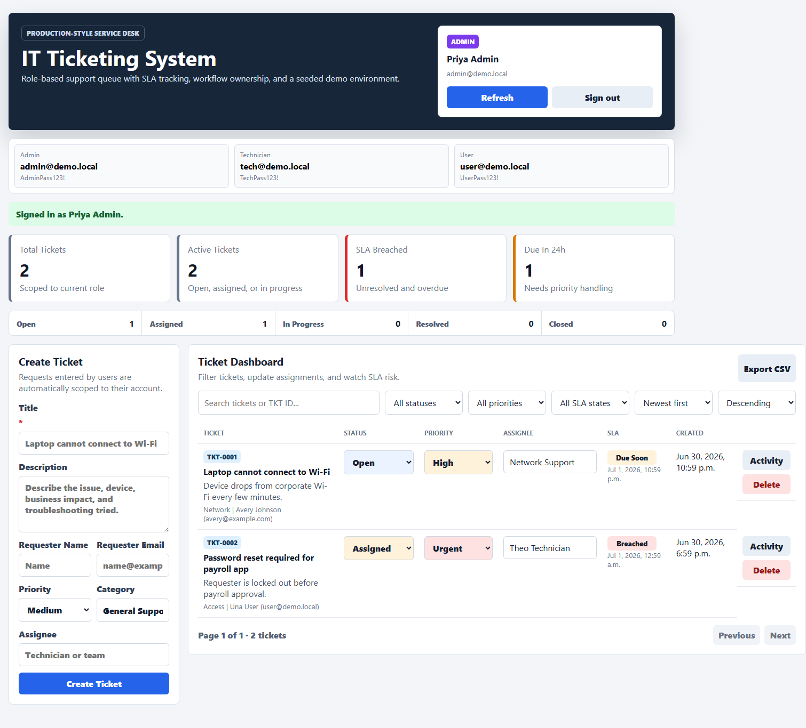
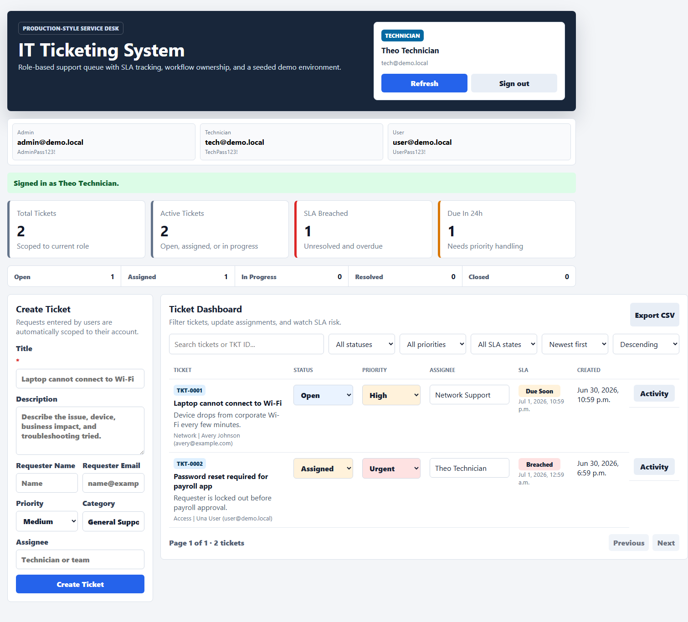
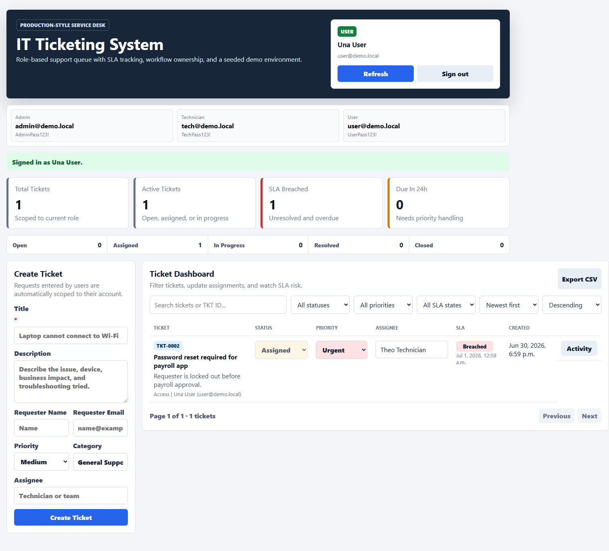

# IT Ticketing System


A production-style IT service desk application built with React, Vite, Node.js, Express, and MongoDB. It demonstrates ticket lifecycle management, role-based access, SLA visibility, REST API validation, automated API and end-to-end testing, CI/CD checks, Docker deployment, and application-support runbooks.

## Live Demo

The project is Vercel-ready through the existing `api/` serverless adapters. Add the required environment variables before deploying.

## Demo Credentials

| Role       | Email              | Password        | Permissions                                |
| ---------- | ------------------ | --------------- | ------------------------------------------ |
| Admin      | `admin@demo.local` | `AdminPass123!` | Full queue, update tickets, delete tickets |
| Technician | `tech@demo.local`  | `TechPass123!`  | Full queue, update workflow and assignment |
| User       | `user@demo.local`  | `UserPass123!`  | Create and view own tickets only           |

The app also exposes these accounts in the login strip for quick portfolio demos.

## Why This Project Matters

This project is based on real IT support workflows: ticket intake, triage, assignment, priority handling, SLA tracking, status updates, role-based access, and incident documentation.

It connects software development with practical service-management experience, making it relevant for:

- QA Automation / SDET co-op roles
- Application Support Analyst co-op roles
- DevOps / IT Automation co-op roles
- Software Developer co-op roles

## Portfolio Highlights

- Authentication with signed demo bearer tokens
- Role-based access for `admin`, `technician`, and `user`
- Ticket workflow: `open`, `assigned`, `in-progress`, `resolved`, `closed`
- SLA dashboard with breached and due-soon counts
- Priority model: `urgent`, `high`, `medium`, `low`
- User-scoped ticket visibility for requester accounts
- Admin-only destructive actions
- Seeded demo credentials and realistic ticket data
- Human-friendly ticket IDs such as `TKT-0001`
- Activity timeline for workflow and assignment changes
- Paginated, sortable, filterable ticket list API
- Role-scoped CSV export
- Jest + Supertest API tests and Playwright E2E tests
- Dockerfile and Docker Compose setup
- GitHub Actions CI for formatting, install, test, build, and audit checks
- API documentation and support runbooks in [docs](docs)

## Screenshots

### Admin Dashboard



### Technician Dashboard



### User Dashboard



## Tech Stack

| Layer    | Tooling                                                            |
| -------- | ------------------------------------------------------------------ |
| Frontend | React 18, Vite                                                     |
| Backend  | Node.js, Express                                                   |
| Database | MongoDB, Mongoose                                                  |
| Testing  | Jest, Supertest                                                    |
| DevOps   | Docker, Docker Compose, GitHub Actions, Vercel-ready API functions |

## Features

- Demo authentication with expiring signed bearer tokens
- Ticket creation, update, delete, filtering, and SLA status display
- Ticket numbers, pagination, sorting, CSV export, and activity timeline
- Role-aware ticket visibility and permissions
- SLA stats by status, priority, breached tickets, and due-soon tickets
- Seed script for predictable demo data
- Centralized API error handling for deployment and database issues

## Testing

```bash
npm test
npm run test:e2e
npm run format:check
npm run build
```

The API test suite covers signed demo authentication, protected ticket routes, role-protected delete behavior, dashboard stats, pagination validation, CSV export, ticket numbers, and structured activity. Playwright covers login, role permissions, ticket workflow, export, and screenshot captures.

## CI/CD

GitHub Actions run on push and pull requests to `main`:

- `npm ci`
- `npm run format:check`
- `npm test`
- `npm run build`
- `npm audit --audit-level=high` as a non-blocking audit step

The separate E2E workflow installs Chromium and runs `npm run test:e2e`.

## Local Setup

1. Install dependencies:

```bash
npm install
```

2. Create environment variables:

```bash
cp .env.example .env
```

3. Set `MONGODB_URI` in `.env`. For local MongoDB:

```env
MONGODB_URI=mongodb://127.0.0.1:27017/it_ticketing
PORT=5000
AUTH_SECRET=replace-with-a-long-random-secret
```

4. Run the app:

```bash
npm run dev
```

Open `http://localhost:5173`.

5. Seed demo tickets:

```bash
npm run seed
```

## Docker Setup

Run the app and MongoDB together:

```bash
docker compose up --build
```

The API runs at `http://localhost:5000`. The production container serves the built frontend assets and API from the same Express process.

## API Overview

Full endpoint documentation lives in [docs/API.md](docs/API.md).

| Method   | Endpoint              | Purpose                       |
| -------- | --------------------- | ----------------------------- |
| `GET`    | `/api/health`         | Health check                  |
| `POST`   | `/api/auth/login`     | Demo login                    |
| `GET`    | `/api/auth/me`        | Current session               |
| `GET`    | `/api/tickets`        | List visible tickets          |
| `GET`    | `/api/tickets/export` | Export visible tickets as CSV |
| `GET`    | `/api/tickets/stats`  | SLA/status/priority stats     |
| `POST`   | `/api/tickets`        | Create ticket                 |
| `PATCH`  | `/api/tickets/:id`    | Update ticket                 |
| `DELETE` | `/api/tickets/:id`    | Admin-only delete             |

## Project Structure

```text
it-ticketing-system/
|-- .github/workflows/ci.yml
|-- api/                         # Vercel API adapters
|-- docs/                        # API docs, runbooks, architecture, test plan
|-- scripts/seed.js              # Demo ticket seeder
|-- src/client/                  # React frontend
|-- src/server/                  # Express API, auth, routes, model
|-- tests/e2e/                   # Playwright browser tests
|-- Dockerfile
|-- docker-compose.yml
|-- package.json
|-- server.js
`-- vite.config.mjs
```

## Documentation

- [API Documentation](docs/API.md)
- [Test Plan](docs/TEST_PLAN.md)
- [Bug Report Examples](docs/BUG_REPORT_EXAMPLES.md)
- [Application Support Runbook](docs/RUNBOOK.md)
- [Security Notes](docs/SECURITY_NOTES.md)
- [Architecture](docs/ARCHITECTURE.md)
- [Accessibility Checklist](docs/ACCESSIBILITY_CHECKLIST.md)
- [Implementation Summary](docs/IMPLEMENTATION_SUMMARY.md)

## Deployment

This project can deploy to Vercel with the existing `api/` functions and Vite build output.

Required environment variables:

```text
MONGODB_URI
AUTH_SECRET
```

See [DEPLOYMENT.md](DEPLOYMENT.md) for the existing Vercel walkthrough.

## Security Notes

This project uses demo authentication for portfolio review. See [docs/SECURITY_NOTES.md](docs/SECURITY_NOTES.md) for production hardening recommendations.

## Future Improvements

- Real user administration with password hashing
- Email notifications for assignment and SLA risk
- Full audit retention for deleted tickets
- Advanced reporting and saved filters

## License

MIT
