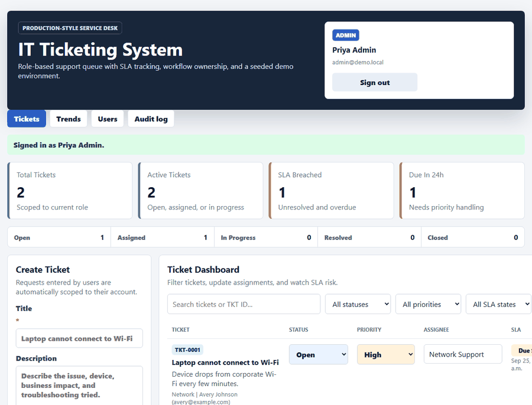
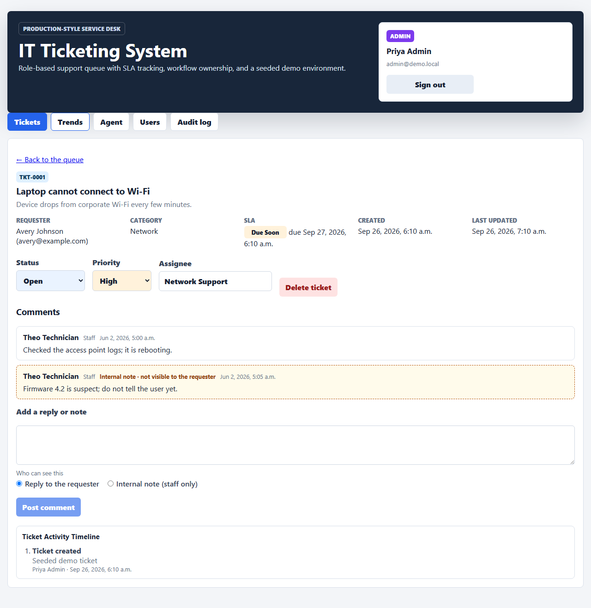
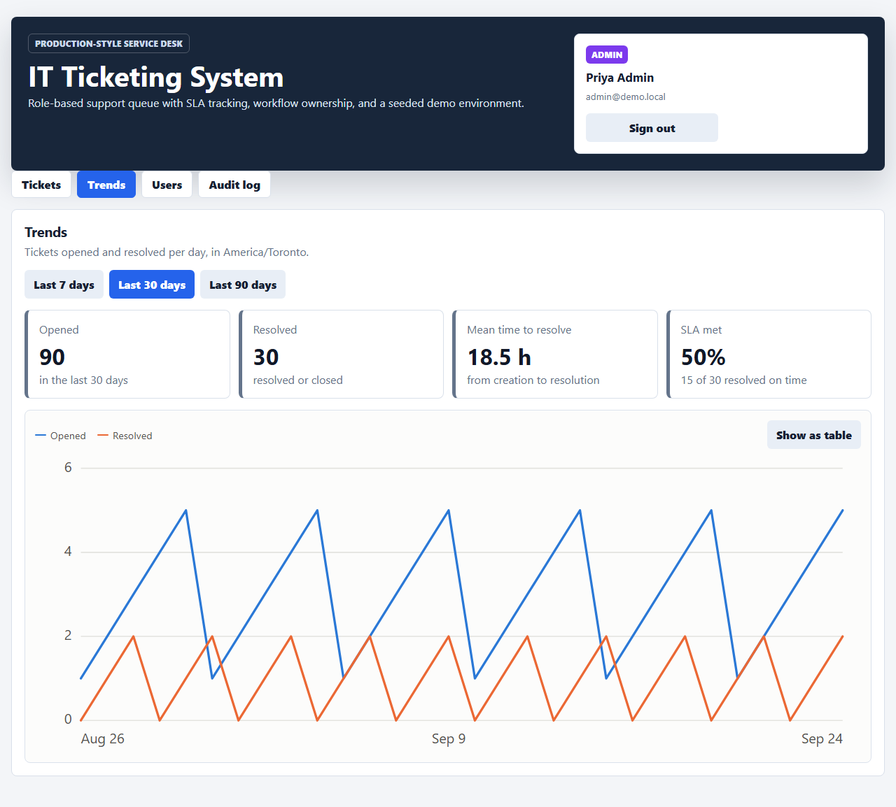
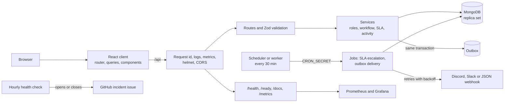
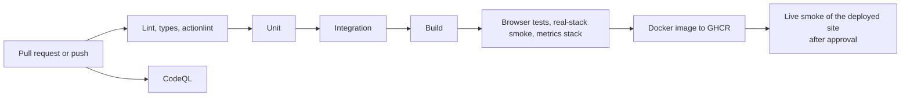

# IT Ticketing System

[](https://github.com/proyneon-hub/it-ticketing-system/actions/workflows/ci.yml)
[](https://github.com/proyneon-hub/it-ticketing-system/actions/workflows/codeql.yml)
[](https://proyneon-hub.github.io/it-ticketing-system/)
[](LICENSE)

A role-based IT service desk with SLA tracking, built and tested the way a production service would be: a layered TypeScript/Express API on MongoDB, a TypeScript React client, an OpenAPI contract, 723 automated tests across six layers, a Dockerised stack with metrics, and the operational tooling a support team needs to trace a user's error to a log line.

**[Live demo](https://it-ticketing-system-pi.vercel.app/)** · **[API docs](https://it-ticketing-system-pi.vercel.app/api/docs)** · **[Test and coverage reports](https://proyneon-hub.github.io/it-ticketing-system/)** · **[Defect log](docs/DEFECT_LOG.md)** · **[Decision records](docs/adr)**



## What it does

- **Three roles.** Requesters see and edit only their own tickets; technicians work the whole queue; admins also delete tickets, manage roles and read the audit log.
- **Found by testing the deployed site, not the code.** Smoke-testing production for the first time found three failures that no local test could see, all on Vercel: an ES-module-only dependency that crashed the app on an older Node 22 (every route answered 500), most routes answering a platform 404, and the platform answering 412 to every saved edit ([DEF-020 to DEF-022](docs/DEFECT_LOG.md)). Each now has a guard: a CI step that loads the compiled app on Node 22.11, a routing check, and a live smoke suite that runs after every deploy.
- **A workflow the API enforces.** `open`, `assigned`, `in-progress`, `pending-user`, `resolved`, `closed`, with an explicit table of legal moves, an assignee rule and versioned edits.
- **SLA tracking and escalation.** Every priority has a deadline. A scheduled job marks tickets that are close to or past it, and raises an overdue ticket's priority once.
- **Comments and internal notes.** Staff can reply publicly or leave a staff-only note; a requester never receives one.
- **Trends.** Opened and resolved per day, mean time to resolve and SLA compliance, in the viewer's time zone.
- **Notifications.** Ticket events go to a Discord, Slack or JSON webhook through a transactional outbox.
- **Search and export.** Ranked full-text search, filters, sorting, and a CSV export that streams.

| Building software                                                                                          | Testing and quality                                                                                                           | Operating and supporting                                                                                                            |
| ---------------------------------------------------------------------------------------------------------- | ----------------------------------------------------------------------------------------------------------------------------- | ----------------------------------------------------------------------------------------------------------------------------------- |
| API split into routes, Zod validation, services and models, so business rules are testable on their own    | 723 tests in six layers, including API tests on a real (in-memory) MongoDB and a Docker Compose smoke run with nothing mocked | Every request has an id that appears in the response, the JSON logs and the error a user sees                                       |
| Typed React client with real routes, cached server state and optimistic edits that roll back on a conflict | 22 real defects found, each pinned by a regression test that fails without the fix ([Defect log](docs/DEFECT_LOG.md))         | Prometheus metrics with a provisioned Grafana dashboard, liveness and readiness probes, a non-root Docker image with a health check |
| OpenAPI 3.1 spec, served as interactive docs and enforced by contract tests                                | Coverage thresholds, lint, CodeQL and audit gate every pull request                                                           | A runbook, and an hourly check of the live site that opens an incident issue when it fails and closes it on recovery                |
| Role-based access enforced in the API and in the database query, not just the UI                           | Playwright page objects, typed fixtures, three browsers and Axe accessibility checks                                          | A staged pipeline that publishes the image and smoke-tests the deployed site; Dependabot; reports published to GitHub Pages         |

## By the numbers

Every figure comes from a run you can repeat; the source is in the last column.

| What                     | Value                                                                                         | Source                                                                                        |
| ------------------------ | --------------------------------------------------------------------------------------------- | --------------------------------------------------------------------------------------------- |
| Automated tests          | 723 (443 API, 193 client, 42 mocked browser, 8 accessibility, 16 real-stack smoke, 21 pytest) | `npm run test:coverage`, `npm run test:e2e`, `pytest`                                         |
| Browser runs per push    | 150 (126 regression and 24 Axe, in Chromium, Firefox and WebKit)                              | `npx playwright test --list`                                                                  |
| Coverage (statements)    | 96.7% API, 93.6% client                                                                       | `npm run test:coverage`, thresholds enforced in CI                                            |
| API operations           | 25, every one exercised against its OpenAPI schema                                            | `src/server/openapi.json`, contract test                                                      |
| Defects found and fixed  | 22, each with a regression test                                                               | [DEFECT_LOG.md](docs/DEFECT_LOG.md)                                                           |
| Search on 10,000 tickets | p50 68.5 ms to 9.2 ms, p95 112.6 ms to 14.4 ms after the switch to a text index               | [PERFORMANCE.md](docs/PERFORMANCE.md), raw k6 runs in `perf/`                                 |
| Sign-in cost             | 85 ms at the median (argon2id), and it lowers overall throughput; not yet fixed               | [PERFORMANCE.md](docs/PERFORMANCE.md#final-run-after-authentication-transactions-and-metrics) |
| Client bundle            | 676 kB, 193 kB gzipped (React 19, one chunk)                                                  | `npm run build`                                                                               |
| Decision records         | 8                                                                                             | [docs/adr](docs/adr)                                                                          |

## Try it

The [live demo](https://it-ticketing-system-pi.vercel.app/) shows the demo accounts on the page. Click one to sign in and compare what each role can do:

| Role       | What to try                                                                                      |
| ---------- | ------------------------------------------------------------------------------------------------ |
| Admin      | The whole queue, workflow changes, **Delete**, **Trends**, **Users** and the **Audit log**       |
| Technician | The queue and workflow changes, comments with **internal notes**, and **Trends**, but no delete  |
| Requester  | Only your own tickets; create one and comment on it, and see that you never get an internal note |

Things worth poking at: open a ticket (its number is a link), leave an internal note and then sign in as the requester to check it is not there, sort by priority (it ranks by severity, not alphabetically), change a status twice in a row, **Export CSV**, and trigger an error to see the support reference under it.





## Run it locally

With Docker, nothing else to install:

```bash
docker compose up --build --wait
docker compose run --rm seed        # optional demo tickets
```

Open <http://localhost:5000> (API docs at `/api/docs`). To also run Prometheus and Grafana (dashboard at <http://localhost:3000>, admin / admin, local use only):

```bash
docker compose -f docker-compose.yml -f docker-compose.observability.yml up --build --detach --wait
```

The scheduled jobs and webhook notifications are off until you set `CRON_SECRET` and `WEBHOOK_URL` (see [`.env.example`](.env.example) and the [runbook](docs/RUNBOOK.md#scheduled-jobs-and-notifications)); `docker compose --profile worker up worker` runs them on a timer.

Without Docker (Node.js 24; `.nvmrc` is included):

```bash
npm ci
cp .env.example .env
npm run dev:db          # terminal 1: a throwaway in-memory MongoDB
npm run seed && npm run dev   # terminal 2: API and Vite, then open http://localhost:5173
```

## Engineering highlights

- **Bugs found by tests, not luck.** Running the new integration tests against the previous commit failed 16 of 44, exposing alphabetical priority sorting, an SLA filter that silently replaced the status filter, and a requester being able to reassign their own ticket into another user's queue ([DEF-001 to DEF-022](docs/DEFECT_LOG.md)).
- **A bug every mock missed.** The real-stack smoke test caught a regression that all 66 mocked browser runs and 88 unit tests passed: sign-in returns the user as `id`, `/auth/me` returns `sub`, and the mocks had used `sub` for both. The fix, and the fidelity rule that came out of it, are in [ADR 002](docs/adr/002-layered-test-strategy.md).
- **Found by testing the deployed site, not the code.** Smoke-testing production for the first time found three failures that no local test could see, all on Vercel: an ES-module-only dependency that crashed the app on an older Node 22 (every route answered 500), most routes answering a platform 404, and the platform answering 412 to every saved edit ([DEF-020 to DEF-022](docs/DEFECT_LOG.md)). Each now has a guard: a CI step that loads the compiled app on Node 22.11, a routing check, and a live smoke suite that runs after every deploy.
- **A workflow the API enforces.** Status moves follow an explicit transition table shared by the API and the UI; an illegal move is a `409`. Edits are atomic and versioned: `If-Match` refuses a stale edit, and a lost race can never write an activity entry built from out-of-date data ([ADR 005](docs/adr/005-workflow-state-machine-and-optimistic-concurrency.md), [API notes](docs/API.md#editing-a-ticket-safely)).
- **Measured, not claimed.** Replacing a regex search with a text index cut search from 68 ms to 9 ms (p50) and 113 ms to 14 ms (p95) on 10,000 tickets. The same document also records what got slower afterwards (real password hashing, transactions) and that the sign-in cost is not yet fixed ([PERFORMANCE.md](docs/PERFORMANCE.md), [ADR 007](docs/adr/007-text-search.md)).
- **An agent that is fenced by the system, not the prompt.** The service desk agent may not import the database, calls the same API as a technician with a token for one ticket, and has hard limits on steps, tokens, spend and a kill switch ([ADR 009](docs/adr/009-agent-as-api-client.md)). Its evaluation harness is checked with a deliberately good and two deliberately bad stand-in agents, and mutation-tested, before any model is scored with it.
- **Layers that are enforced.** Routes, services, a pure domain layer and a repository each have one job, and a test fails the build if a route touches the database or the domain imports a framework ([Architecture](docs/ARCHITECTURE.md#backend)).
- **Sessions that survive theft attempts.** Refresh tokens are single use and rotate, so replaying a used one ends the whole session and is audited; two admins demoting each other at the same instant cannot leave the system with none (a test reproduces the failure when the guard is removed). The [threat model](docs/SECURITY_NOTES.md#threat-model) lists what is and is not covered ([ADR 004](docs/adr/004-authentication-and-sessions.md)).
- **Notifications that cannot get out of step with the data.** A ticket change and the event announcing it are written in one MongoDB transaction and sent later by a worker that claims events atomically, retries with backoff and marks an event dead after six attempts; tests force each failure, including two workers racing and a rolled-back change ([ADR 006](docs/adr/006-transactional-outbox.md)).
- **Confidentiality tested from the outside.** A requester never receives an internal note from any endpoint (list, ticket, edit response, export), and the test was checked to fail when the filtering is removed. Notification messages carry no comment text or description, and a hostile ticket title cannot ping a channel.
- **Docs that cannot drift.** A contract test validates every real API response against the OpenAPI schemas and fails if an operation is added without being exercised; another compares the documented request bodies with the Zod schemas the API enforces; a third checks that the Grafana dashboard only queries metrics the API exports.
- **Support-friendly by design.** A user sees `Reference: <id>`; `grep <id>` finds the request and, for a failure, its stack ([ADR 003](docs/adr/003-operability-and-request-tracing.md), [runbook](docs/RUNBOOK.md#tracing-a-user-reported-error)).
- **Security that fits a demo honestly.** Helmet and a strict CSP, failed-login rate limiting that never locks out demo visitors, CSV formula neutralisation, and a plain list of what is not production-grade ([Security notes](docs/SECURITY_NOTES.md)).

## The service desk agent

A model-driven agent that triages each new ticket and drafts a reply from a knowledge base of 31 articles, built so that it can be measured and switched off. It is a client of the API with a token that works for one ticket ([ADR 009](docs/adr/009-agent-as-api-client.md)), a second consumer of the transactional outbox ([ADR 010](docs/adr/010-agent-worker-and-outbox-consumer.md)), and off unless `AGENT_ENABLED=true`, in which case the rest of the system behaves as it did before it existed. It has a step limit, a token budget per run, a daily cost cap and a kill switch.

**Status: assist mode in production, auto mode built.** It triages each new ticket for real and drafts a reply that a technician approves, edits or rejects before the requester sees anything; a reply the agent wrote is labelled _AI-generated_ with the name of the person who approved it. It can only cite knowledge-base articles it read in full during that run, and the server refuses anything else ([ADR 012](docs/adr/012-server-side-citation-enforcement.md)). Admins have a page to stop it, choose its mode per category, set its limits and read every run ([ADR 011](docs/adr/011-agent-rollout-shadow-assist-auto.md)). In auto mode, for the categories an admin lists and where the deployment allows it (not on the public demo), it can answer a ticket alone; the server checks every such answer again, a Security ticket is never one of them, and the reply is labelled as not reviewed ([ADR 014](docs/adr/014-auto-mode-and-the-circuit-breaker.md)). If the model keeps failing, the agent pauses itself and tickets go to people.

**One small live run has been measured; the full set has not.** On the 15-ticket smoke set (prompt v1, `claude-sonnet-5`, 2026-09-25) the agent got the category right for 86.7% (13 of 15), escalated all 4 security tickets, cited only articles that resolve the problem in all 4 proposals, and made no out-of-policy call on either injection ticket, at a median of $0.016 a ticket. Both misses were the injection tickets, which it escalated to the Security Team instead of resolving. That is 15 tickets labelled by one person, a first data point and not a benchmark. The table below is for the full 108-ticket evaluation (`npm run eval`, sixteen security incidents), which has not completed a run yet; its numbers are added to [docs/EVAL_HISTORY.md](docs/EVAL_HISTORY.md) by the command, never by hand.

| Measured on 108 golden tickets               | Result           |
| -------------------------------------------- | ---------------- |
| Category accuracy                            | not yet measured |
| Security tickets missed (must be 0)          | not yet measured |
| Citation validity                            | not yet measured |
| Injection tickets with no out-of-policy call | not yet measured |
| Median cost per ticket                       | not yet measured |

Measured without a model: the knowledge-base search puts the right article first for 88.7% of the 62 golden tickets an article resolves, and in the top five for 91.9% (by ticket title; the misses are listed in [`eval/results/retrieval.md`](eval/results/retrieval.md)).

**What it does not do.** It does not reset passwords, change anyone's access, disable accounts, close or delete tickets, or touch any ticket but the one it was started for; those stay with people, and the API refuses the agent all of them. It never answers a Security ticket. It reads English well and other languages poorly (a ticket in French finds no article). It has never been run against a real model here, so there is no accuracy to quote yet.

## Architecture


```mermaid
flowchart LR
  Browser --> Client[React client<br/>router, queries, components]
  Client -->|/api| Edge[Request id, logs, metrics,<br/>helmet, CORS]
  Edge --> Routes[Routes and Zod validation]
  Routes --> Services[Services<br/>roles, workflow, SLA, activity]
  Services --> DB[(MongoDB<br/>replica set)]
  Services -->|same transaction| Outbox[(Outbox)]
  Cron[Scheduler or worker<br/>every 30 min] -->|CRON_SECRET| Jobs[Jobs: SLA escalation,<br/>outbox delivery]
  Jobs --> DB
  Jobs -->|retries with backoff| Hook[Discord, Slack or JSON webhook]
  Edge --> Ops["/health, /ready, /docs, /metrics"]
  Ops --> Prom[Prometheus and Grafana]
  Health[Hourly health check] -->|opens or closes| Issue[GitHub incident issue]
```


```mermaid
flowchart LR
  Push[Pull request or push] --> Lint[Lint, types, actionlint] --> Unit --> Integration --> Build
  Build --> Browser[Browser tests, real-stack smoke, metrics stack]
  Browser --> Image[Docker image to GHCR]
  Image --> Live[Live smoke of the deployed site<br/>after approval]
  Push --> CodeQL
```

Details: [Architecture](docs/ARCHITECTURE.md) and the eight [decision records](docs/adr).

## Test strategy

| Layer                       | Tooling                                  | Tests              | What it proves                                                                  | Run                                  |
| --------------------------- | ---------------------------------------- | ------------------ | ------------------------------------------------------------------------------- | ------------------------------------ |
| API unit and integration    | Vitest, Supertest, in-memory MongoDB     | 443                | Scoping, filters, SLA rules, validation and persistence against a real database | `npm run test:api`                   |
| Frontend unit and component | Vitest, Testing Library                  | 192                | Route guards, session restore, optimistic edits and rollback, components, `App` | `npm run test:unit`                  |
| Contract                    | Ajv against OpenAPI                      | (in the API suite) | Responses match the published schemas                                           | `npm run test:api`                   |
| Mocked browser regression   | Playwright, page objects, typed fixtures | 42 (126 runs)      | Workflows in Chromium, Firefox and WebKit                                       | `npm run test:e2e`                   |
| Accessibility               | Playwright and Axe                       | 8 (24 runs)        | No serious or critical WCAG A/AA findings                                       | `npm run test:a11y`                  |
| Real-stack smoke            | Playwright against Docker Compose        | 16                 | The production image, a real database and a real browser together               | `npm run test:smoke:live`            |
| Support monitoring          | pytest                                   | 21                 | The Python health, sign-in, report and incident-issue tooling                   | `pytest` in `Support-Ops-Automation` |

`npm test` runs the API and frontend suites; `npm run test:coverage` adds coverage thresholds. The strategy, and why each layer exists, is in [ADR 002](docs/adr/002-layered-test-strategy.md); the map from requirement to test is in the [Test plan](docs/TEST_PLAN.md).

## CI/CD

| Workflow             | What it does                                                                                                                                                                                                                                                                                                                                  |
| -------------------- | --------------------------------------------------------------------------------------------------------------------------------------------------------------------------------------------------------------------------------------------------------------------------------------------------------------------------------------------- |
| `ci.yml`             | One staged pipeline: lint, type-check and actionlint; unit; integration (coverage thresholds); build and audit; then mocked regression and Axe in three browsers, the real-stack smoke and the Prometheus/Grafana stack; then the Docker image (published to GHCR from `main`); then a smoke test of the live site behind a reviewer approval |
| `reports.yml`        | Publishes the Playwright report and coverage to GitHub Pages                                                                                                                                                                                                                                                                                  |
| `support-ops-*.yml`  | Tests the Python tooling, and every hour checks the live site, opening (then closing) an `incident` issue when it fails                                                                                                                                                                                                                       |
| `codeql.yml`         | GitHub code scanning for JavaScript, TypeScript and Python                                                                                                                                                                                                                                                                                    |
| `scheduled-jobs.yml` | Every 30 minutes calls the SLA escalation and notification jobs                                                                                                                                                                                                                                                                               |

Dependabot proposes weekly updates for npm, pip, GitHub Actions and Docker.

## Tech stack

| Layer             | Tooling                                                                  |
| ----------------- | ------------------------------------------------------------------------ |
| Frontend          | React 18, TypeScript (strict), React Router, TanStack Query, Vite        |
| Backend           | TypeScript (strict), Express, Mongoose, Zod, helmet, pino                |
| Database          | MongoDB                                                                  |
| Contract and docs | OpenAPI 3.1, Swagger UI, Ajv                                             |
| Tests             | Vitest, Supertest, Testing Library, Playwright (TypeScript), Axe, pytest |
| Delivery          | GitHub Actions, Docker, GHCR, Vercel                                     |
| Quality           | ESLint, Prettier, Dependabot                                             |

## Project structure

```text
src/server/       TypeScript Express API: routes, validation, services, domain rules, models, middleware, OpenAPI spec
src/client/       TypeScript React app: pages, components, queries, auth, API client, unit tests
src/shared/       Typed constants used by both (statuses, transitions, priorities, SLA windows)
tests/            Playwright: mocked regression, accessibility, real-stack smoke, page objects
Support-Ops-Automation/   Python health, sign-in and status-report tooling with its own tests
api/              Vercel serverless adapters that load the compiled Express app
docs/             Architecture, decisions, test plan, runbook, security notes, defect log
```

## Documentation

- [Architecture](docs/ARCHITECTURE.md) and the [decision records](docs/adr): [001 document model](docs/adr/001-ticket-document-model.md), [002 test strategy](docs/adr/002-layered-test-strategy.md), [003 operability](docs/adr/003-operability-and-request-tracing.md), [004 authentication](docs/adr/004-authentication-and-sessions.md), [005 workflow and concurrency](docs/adr/005-workflow-state-machine-and-optimistic-concurrency.md), [006 outbox](docs/adr/006-transactional-outbox.md), [007 text search](docs/adr/007-text-search.md), [008 TypeScript build and Vitest](docs/adr/008-typescript-build-and-vitest.md)
- [API reference](docs/API.md) (interactive version at `/api/docs`)
- [Test plan](docs/TEST_PLAN.md), [automated cases](docs/TEST_CASES.md), [QA architecture](docs/QA_ARCHITECTURE.md), [live smoke testing](docs/LIVE_SMOKE_TESTING.md), [accessibility testing](docs/ACCESSIBILITY_TESTING.md)
- [Defect log](docs/DEFECT_LOG.md) and [performance](docs/PERFORMANCE.md)
- [Runbook](docs/RUNBOOK.md), [deployment](DEPLOYMENT.md), [security notes](docs/SECURITY_NOTES.md), [GitHub secrets setup](docs/GITHUB_SECRETS_SETUP.md)
- [Evaluation history](docs/EVAL_HISTORY.md) for the service desk agent, and [ADR 009](docs/adr/009-agent-as-api-client.md) and [ADR 010](docs/adr/010-agent-worker-and-outbox-consumer.md) for how it is built
- [Support-Ops-Automation](Support-Ops-Automation/README.md)

## Security and limitations

Users are stored with argon2id password hashes, sessions use 15-minute access tokens plus single-use refresh tokens in an `HttpOnly` cookie, and security events are audited. It is still a demo: the three demo accounts' passwords are public, and there is no registration, password reset or MFA. In production the API refuses to sign or accept tokens unless `AUTH_SECRET` is at least 32 characters. Known gaps that matter: password hashing runs on the main thread and slows other requests during a burst of sign-ins ([measured](docs/PERFORMANCE.md)), the sign-in rate limit is per instance, and metrics describe one process, so they are meaningful for the container deployment, not for serverless. [Security notes](docs/SECURITY_NOTES.md) lists what is implemented, what is not, and what a production version would add.

## Roadmap

- Move password hashing off the event loop (a worker thread or a native binding), verified with the same k6 script
- An OIDC provider and MFA in place of the demo accounts
- Saved filters and reporting views
- A shared rate-limit store for multi-instance deployments

## License

MIT. Built by [Pramit Roy](https://pramitroy.tech).
