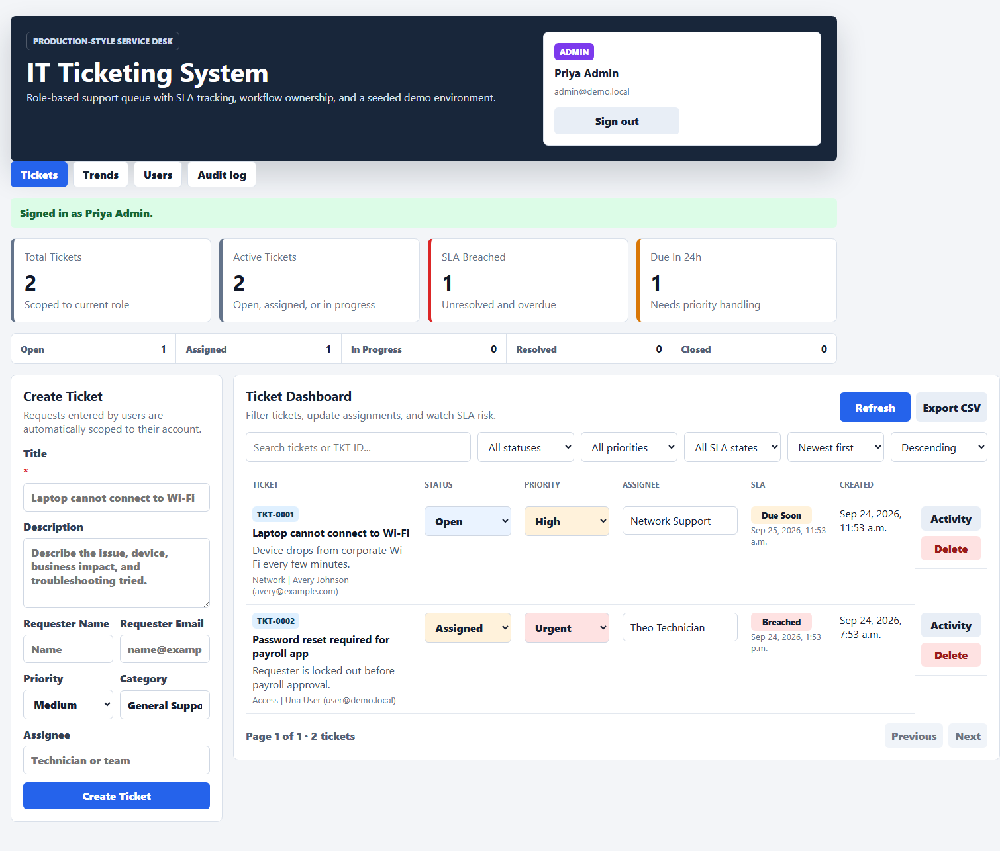
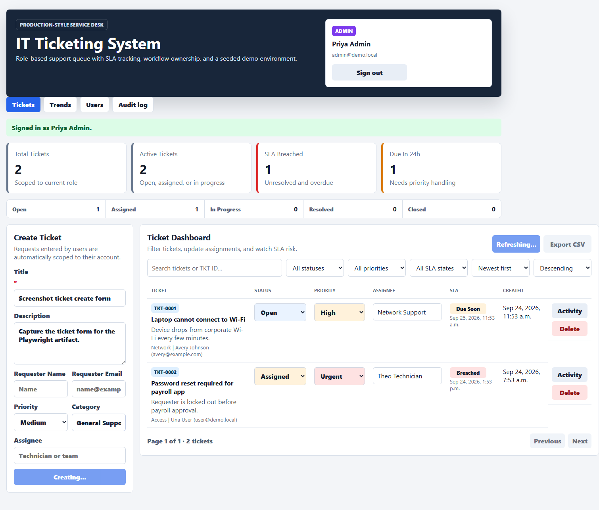
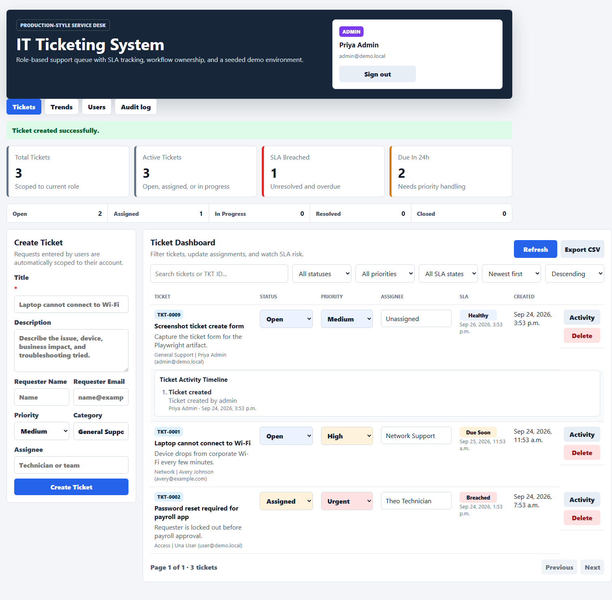
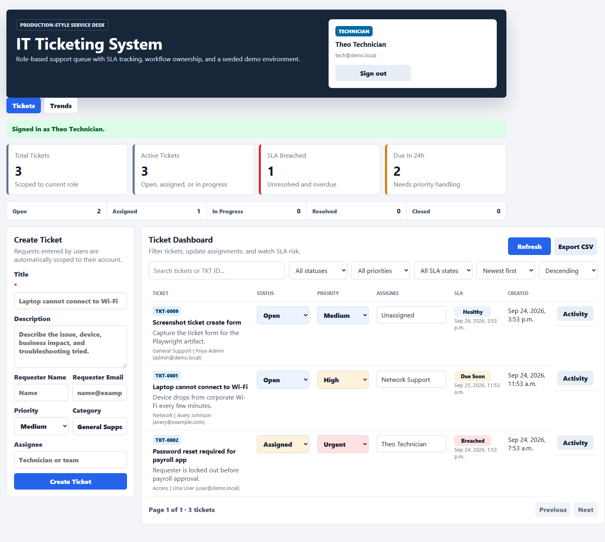
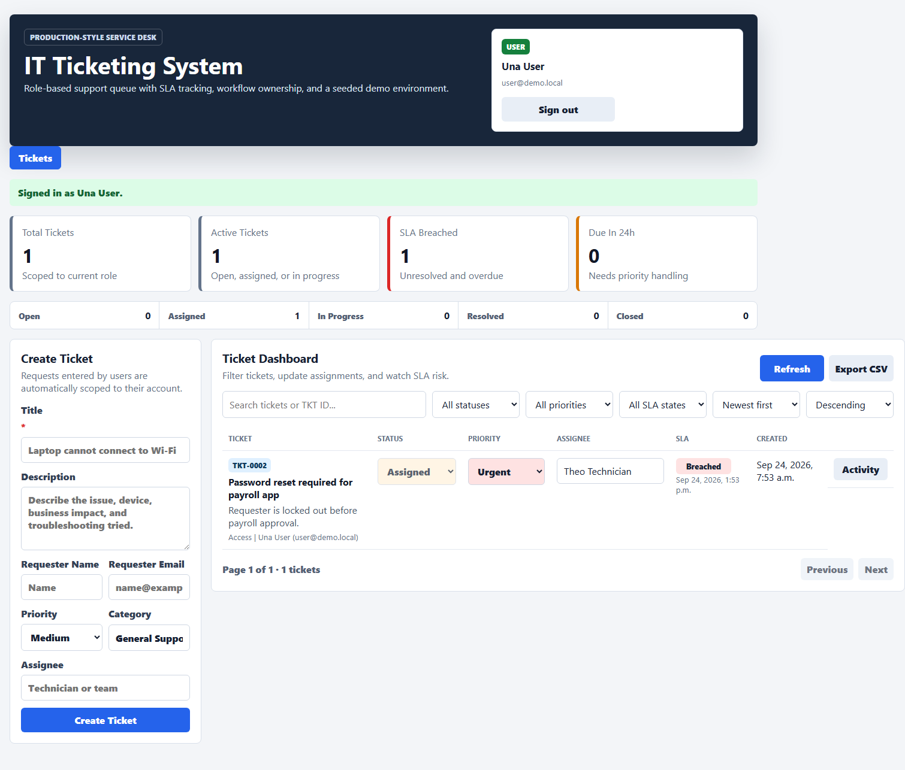

# IT Ticketing System


A production-style IT service desk application with role-based ticket management and a TypeScript Playwright QA framework. It demonstrates support workflows, API validation, cross-browser regression testing, accessibility checks, and CI diagnostics.

## Live Demo

Try the deployed application at [it-ticketing-system-pi.vercel.app](https://it-ticketing-system-pi.vercel.app/). The deployment health endpoint is available at [`/api/health`](https://it-ticketing-system-pi.vercel.app/api/health).

## Screenshots

### Admin Dashboard



### Ticket Creation



### Ticket Activity



### Technician and Requester Views





## Business Problem

IT teams need a clear way to record requests, prioritize work, assign ownership, track SLA risk, and enforce permissions. This project models those workflows while keeping the API responsible for authorization and validation.

## Main Features

- Signed demo authentication with admin, technician, and requester roles.
- Ticket creation, updates, deletion, assignment, filtering, sorting, pagination, SLA status, and structured activity history.
- Role-scoped ticket visibility and CSV export.
- Express REST API backed by MongoDB/Mongoose, plus Vite/React frontend.
- Jest/Supertest API coverage and TypeScript Playwright browser coverage.

## User Roles

| Role       | Access                                                    |
| ---------- | --------------------------------------------------------- |
| Admin      | Full queue, ticket updates, assignment, and deletion.     |
| Technician | Full queue and workflow updates, without delete controls. |
| Requester  | Create tickets and view only requester-scoped records.    |

Demo accounts are shown in the app for portfolio review. They are not production authentication accounts.

## Technology Stack

| Layer         | Tooling                                            |
| ------------- | -------------------------------------------------- |
| Frontend      | React 18, Vite                                     |
| Backend       | Node.js, Express                                   |
| Database      | MongoDB, Mongoose                                  |
| API tests     | Jest, Supertest                                    |
| Browser tests | TypeScript, Playwright, Axe                        |
| Delivery      | GitHub Actions, Docker, Vercel-ready API functions |

## Architecture

The frontend calls an Express REST API through `/api`; the API applies demo authentication and role checks before reading or writing MongoDB data. The full QA execution model is documented in [QA Architecture](docs/QA_ARCHITECTURE.md).

## QA Automation

The repository includes a TypeScript Playwright framework with:

- Page Objects, typed fixtures, and reusable test users/tickets.
- A deterministic mocked UI regression suite in `tests/e2e-mocked`.
- 20 tagged regression tests across Chromium, Firefox, and WebKit.
- Axe checks for the login, dashboard, and ticket form.
- Failure screenshots, video, traces, HTML reports, and CI artifact uploads.
- A separate safety-gated live smoke suite for health, configured login, and dedicated test-ticket cleanup.

### Mocked regression suite

Mocked tests install controlled API responses for fast, deterministic browser coverage of authentication, permissions, ticket workflows, validation, filters, exports, errors, and loading states. Run with `npm run test:e2e`.

### Live smoke suite

Live smoke tests never install API mocks. They are disabled by default and require `LIVE_SMOKE_ENABLED=true` plus dedicated test credentials; ticket creation uses a `PW-LIVE-` prefix and cleanup. See [Live Smoke Testing](docs/LIVE_SMOKE_TESTING.md).

## Test Strategy

| Layer                | Purpose                                                       | Command                   |
| -------------------- | ------------------------------------------------------------- | ------------------------- |
| API                  | Auth, authorization, validation, and ticket endpoints         | `npm test`                |
| Mocked UI regression | Deterministic role and ticket workflows across three browsers | `npm run test:e2e`        |
| Accessibility        | Serious/critical Axe checks on three critical screens         | `npm run test:a11y`       |
| Live smoke           | Real integration checks when safely configured                | `npm run test:smoke:live` |

## Local Setup

1. Install dependencies:

   ```bash
   npm ci
   ```

2. Copy `.env.example` to `.env` and configure `MONGODB_URI`, `PORT`, and `AUTH_SECRET`.

3. Start the local app:

   ```bash
   npm run dev
   ```

   Open `http://localhost:5173`.

4. Optionally seed predictable tickets:

   ```bash
   npm run seed
   ```

## Environment Variables

| Variable                                 | Purpose                                    |
| ---------------------------------------- | ------------------------------------------ |
| `MONGODB_URI`                            | MongoDB connection string.                 |
| `AUTH_SECRET`                            | Signs demo bearer tokens.                  |
| `LIVE_BASE_URL`                          | Target for live smoke testing.             |
| `E2E_ADMIN_EMAIL` / `E2E_ADMIN_PASSWORD` | Dedicated live-smoke admin credentials.    |
| `LIVE_SMOKE_ENABLED`                     | Must be `true` to enable live smoke tests. |

Never commit real credentials. The live-suite variables are optional unless running configured live smoke tests.

## Test Commands

```bash
npm ci
npm run typecheck:playwright
npm test
npm run test:e2e
npm run test:e2e:headed
npm run test:e2e:ui
npm run test:a11y
npm run test:smoke:live
npm run format:check
npm run build
```

## CI/CD

The main CI workflow runs formatting, API tests, a production build, and an audit. The Playwright regression workflow installs Chromium, Firefox, and WebKit; type-checks the suite; runs mocked regression and Axe checks; and uploads HTML reports plus test-result artifacts.

The live-smoke workflow is manual/scheduled and performs no checks until the required repository secrets are configured.

## Documentation

- [API Documentation](docs/API.md)
- [Test Plan](docs/TEST_PLAN.md)
- [Automated Test Cases](docs/TEST_CASES.md)
- [QA Architecture](docs/QA_ARCHITECTURE.md)
- [Accessibility Testing](docs/ACCESSIBILITY_TESTING.md)
- [Live Smoke Testing](docs/LIVE_SMOKE_TESTING.md)
- [Bug Report Examples](docs/BUG_REPORT_EXAMPLES.md)
- [Security Notes](docs/SECURITY_NOTES.md)
- [Application Support Runbook](docs/RUNBOOK.md)
- [Portfolio Project Copy](docs/PORTFOLIO_PROJECT_COPY.md)

## Security and Limitations

This is a portfolio demo with in-code demo accounts, not a production identity system. Review [Security Notes](docs/SECURITY_NOTES.md) before adapting it for production. Live smoke tests intentionally remain skipped without dedicated non-production credentials.

## Future Improvements

- Persisted user administration with password hashing.
- Notification workflows for assignment and SLA risk.
- Saved filters, advanced reporting, and production identity-provider integration.
- Configured non-production live-smoke credentials and post-deployment verification.

## License

MIT
