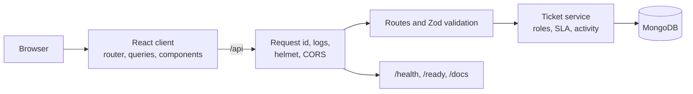

# IT Ticketing System

[](https://github.com/proyneon-hub/it-ticketing-system/actions/workflows/ci.yml)
[](https://github.com/proyneon-hub/it-ticketing-system/actions/workflows/e2e.yml)
[](https://proyneon-hub.github.io/it-ticketing-system/)
[](LICENSE)

A role-based IT service desk with SLA tracking, built and tested the way a production service would be: a layered TypeScript/Express API on MongoDB, a TypeScript React client, an OpenAPI contract, 593 automated tests across six layers, a Dockerised stack, and the operational tooling a support team needs to trace a user's error to a log line.

**[Live demo](https://it-ticketing-system-pi.vercel.app/)** · **[API docs](https://it-ticketing-system-pi.vercel.app/api/docs)** · **[Test and coverage reports](https://proyneon-hub.github.io/it-ticketing-system/)** · **[Defect log](docs/DEFECT_LOG.md)**


## What this project demonstrates

| Building software                                                                                          | Testing and quality                                                                                                           | Operating and supporting                                                                                           |
| ---------------------------------------------------------------------------------------------------------- | ----------------------------------------------------------------------------------------------------------------------------- | ------------------------------------------------------------------------------------------------------------------ |
| API split into routes, Zod validation, services and models, so business rules are testable on their own    | 593 tests in six layers, including API tests on a real (in-memory) MongoDB and a Docker Compose smoke run with nothing mocked | Every request has an id that appears in the response, the JSON logs and the error a user sees                      |
| Typed React client with real routes, cached server state and optimistic edits that roll back on a conflict | 18 real defects found, each pinned by a regression test that fails without the fix ([Defect log](docs/DEFECT_LOG.md))         | Separate liveness (`/api/health`) and readiness (`/api/ready`) probes; a non-root Docker image with a health check |
| OpenAPI 3.1 spec, served as interactive docs and enforced by contract tests                                | Coverage thresholds, lint and audit gate every pull request                                                                   | A runbook, and Python monitoring scripts that check health, sign-in and the ticket API on a schedule               |
| Role-based access enforced in the API and in the database query, not just the UI                           | Playwright page objects, typed fixtures, three browsers and Axe accessibility checks                                          | Structured releases: Docker image to GHCR, Dependabot, reports published to GitHub Pages                           |

## Try it

The [live demo](https://it-ticketing-system-pi.vercel.app/) shows the demo accounts on the page. Click one to sign in and compare what each role can do:

| Role       | What to try                                                                |
| ---------- | -------------------------------------------------------------------------- |
| Admin      | The whole queue, workflow changes, assignment and **Delete**               |
| Technician | The whole queue and workflow changes, but no delete                        |
| Requester  | Only your own tickets; create a ticket, but status and assignee are locked |

Things worth poking at: sort by priority (it ranks by severity, not alphabetically), filter by SLA state, open a ticket's **Activity** timeline, **Export CSV**, and trigger an error to see the support reference under it.

## Run it locally

With Docker, nothing else to install:

```bash
docker compose up --build --wait
docker compose run --rm seed        # optional demo tickets
```

Open <http://localhost:5000> (API docs at `/api/docs`).

Without Docker (Node.js 24; `.nvmrc` is included):

```bash
npm ci
cp .env.example .env
npm run dev:db          # terminal 1: a throwaway in-memory MongoDB
npm run seed && npm run dev   # terminal 2: API and Vite, then open http://localhost:5173
```

## Engineering highlights

- **Bugs found by tests, not luck.** Running the new integration tests against the previous commit failed 16 of 44, exposing alphabetical priority sorting, an SLA filter that silently replaced the status filter, and a requester being able to reassign their own ticket into another user's queue ([DEF-001 to DEF-017](docs/DEFECT_LOG.md)).
- **A bug every mock missed.** The real-stack smoke test caught a regression that all 66 mocked browser runs and 88 unit tests passed: sign-in returns the user as `id`, `/auth/me` returns `sub`, and the mocks had used `sub` for both. The fix, and the fidelity rule that came out of it, are in [ADR 002](docs/adr/002-layered-test-strategy.md).
- **A workflow the API enforces.** Status moves follow an explicit transition table shared by the API and the UI; an illegal move is a `409`. Edits are atomic and versioned: `If-Match` refuses a stale edit, and a lost race can never write an activity entry built from out-of-date data ([API notes](docs/API.md#editing-a-ticket-safely)).
- **Measured, not claimed.** Replacing a regex search with a text index cut search from 68 ms to 9 ms (p50) and 113 ms to 14 ms (p95) on 10,000 tickets, and the method, the raw k6 runs and the trade-off (whole words, not fragments) are in [PERFORMANCE.md](docs/PERFORMANCE.md).
- **Layers that are enforced.** Routes, services, a pure domain layer and a repository each have one job, and a test fails the build if a route touches the database or the domain imports a framework ([Architecture](docs/ARCHITECTURE.md#backend)).
- **Sessions that survive theft attempts.** Refresh tokens are single use and rotate, so replaying a used one ends the whole session and is audited; two admins demoting each other at the same instant cannot leave the system with none (a test reproduces the failure when the guard is removed). The [threat model](docs/SECURITY_NOTES.md#threat-model) lists what is and is not covered.
- **Docs that cannot drift.** A contract test validates every real API response against the OpenAPI schemas and fails if an operation is added without being exercised; another compares the documented request bodies with the Zod schemas the API enforces.
- **Support-friendly by design.** A user sees `Reference: <id>`; `grep <id>` finds the request and, for a failure, its stack ([ADR 003](docs/adr/003-operability-and-request-tracing.md), [runbook](docs/RUNBOOK.md#tracing-a-user-reported-error)).
- **Security that fits a demo honestly.** Helmet and a strict CSP, failed-login rate limiting that never locks out demo visitors, CSV formula neutralisation, and a plain list of what is not production-grade ([Security notes](docs/SECURITY_NOTES.md)).

## Architecture


```mermaid
flowchart LR
  Browser --> Client[React client<br/>router, queries, components]
  Client -->|/api| Edge[Request id, logs,<br/>helmet, CORS]
  Edge --> Routes[Routes and Zod validation]
  Routes --> Services[Ticket service<br/>roles, SLA, activity]
  Services --> DB[(MongoDB)]
  Edge --> Ops["/health, /ready, /docs"]
```

Details: [Architecture](docs/ARCHITECTURE.md) and the three [decision records](docs/adr).

## Test strategy

| Layer                       | Tooling                                  | Tests              | What it proves                                                                  | Run                                  |
| --------------------------- | ---------------------------------------- | ------------------ | ------------------------------------------------------------------------------- | ------------------------------------ |
| API unit and integration    | Vitest, Supertest, in-memory MongoDB     | 328                | Scoping, filters, SLA rules, validation and persistence against a real database | `npm run test:api`                   |
| Frontend unit and component | Vitest, Testing Library                  | 192                | Route guards, session restore, optimistic edits and rollback, components, `App` | `npm run test:unit`                  |
| Contract                    | Ajv against OpenAPI                      | (in the API suite) | Responses match the published schemas                                           | `npm run test:api`                   |
| Mocked browser regression   | Playwright, page objects, typed fixtures | 42 (126 runs)      | Workflows in Chromium, Firefox and WebKit                                       | `npm run test:e2e`                   |
| Accessibility               | Playwright and Axe                       | 8 (24 runs)        | No serious or critical WCAG A/AA findings                                       | `npm run test:a11y`                  |
| Real-stack smoke            | Playwright against Docker Compose        | 14                 | The production image, a real database and a real browser together               | `npm run test:smoke:live`            |
| Support monitoring          | pytest                                   | 9                  | The Python health, sign-in and report tooling                                   | `pytest` in `Support-Ops-Automation` |

`npm test` runs the API and frontend suites; `npm run test:coverage` adds coverage thresholds. The strategy, and why each layer exists, is in [ADR 002](docs/adr/002-layered-test-strategy.md); the map from requirement to test is in the [Test plan](docs/TEST_PLAN.md).

## CI/CD

| Workflow            | What it does                                                                                                                                         |
| ------------------- | ---------------------------------------------------------------------------------------------------------------------------------------------------- |
| `ci.yml`            | Format check, lint, tests with coverage thresholds, production build, dependency audit; builds the Docker image and publishes it to GHCR from `main` |
| `e2e.yml`           | Mocked regression and Axe in three browsers, plus the real-stack smoke job against Docker Compose                                                    |
| `reports.yml`       | Publishes the Playwright report and coverage to GitHub Pages                                                                                         |
| `live-smoke.yml`    | Manual smoke run against a deployed environment, inert until its secrets exist                                                                       |
| `support-ops-*.yml` | Tests the Python tooling and runs a scheduled health check                                                                                           |

Dependabot proposes weekly updates for npm, pip, GitHub Actions and Docker.

## Tech stack

| Layer             | Tooling                                                                  |
| ----------------- | ------------------------------------------------------------------------ |
| Frontend          | React 18, TypeScript (strict), React Router, TanStack Query, Vite        |
| Backend           | TypeScript (strict), Express, Mongoose, Zod, helmet, pino                |
| Database          | MongoDB                                                                  |
| Contract and docs | OpenAPI 3.1, Swagger UI, Ajv                                             |
| Tests             | Vitest, Supertest, Testing Library, Playwright (TypeScript), Axe, pytest |
| Delivery          | GitHub Actions, Docker, GHCR, Vercel                                     |
| Quality           | ESLint, Prettier, Dependabot                                             |

## Project structure

```text
src/server/       TypeScript Express API: routes, validation, services, domain rules, models, middleware, OpenAPI spec
src/client/       TypeScript React app: pages, components, queries, auth, API client, unit tests
src/shared/       Typed constants used by both (statuses, transitions, priorities, SLA windows)
tests/            Playwright: mocked regression, accessibility, real-stack smoke, page objects
Support-Ops-Automation/   Python health, sign-in and status-report tooling with its own tests
api/              Vercel serverless adapters that load the compiled Express app
docs/             Architecture, decisions, test plan, runbook, security notes, defect log
```

## Documentation

- [Architecture](docs/ARCHITECTURE.md) and [decision records](docs/adr)
- [API reference](docs/API.md) (interactive version at `/api/docs`)
- [Test plan](docs/TEST_PLAN.md), [automated cases](docs/TEST_CASES.md), [QA architecture](docs/QA_ARCHITECTURE.md), [live smoke testing](docs/LIVE_SMOKE_TESTING.md), [accessibility testing](docs/ACCESSIBILITY_TESTING.md)
- [Defect log](docs/DEFECT_LOG.md) and [performance](docs/PERFORMANCE.md)
- [Runbook](docs/RUNBOOK.md), [deployment](DEPLOYMENT.md), [security notes](docs/SECURITY_NOTES.md), [GitHub secrets setup](docs/GITHUB_SECRETS_SETUP.md)
- [Support-Ops-Automation](Support-Ops-Automation/README.md)

## Security and limitations

Users are stored with argon2id password hashes, sessions use 15-minute access tokens plus single-use refresh tokens in an `HttpOnly` cookie, and security events are audited. It is still a demo: the three demo accounts' passwords are public, and there is no registration, password reset or MFA. In production the API refuses to sign or accept tokens unless `AUTH_SECRET` is at least 32 characters. [Security notes](docs/SECURITY_NOTES.md) lists what is implemented, what is not, and what a production version would add.

## Roadmap

- An OIDC provider and MFA in place of the demo accounts
- Notifications for assignment and SLA risk
- Saved filters and reporting views
- A shared rate-limit store for multi-instance deployments

## License

MIT. Built by [Pramit Roy](https://pramitroy.tech).
