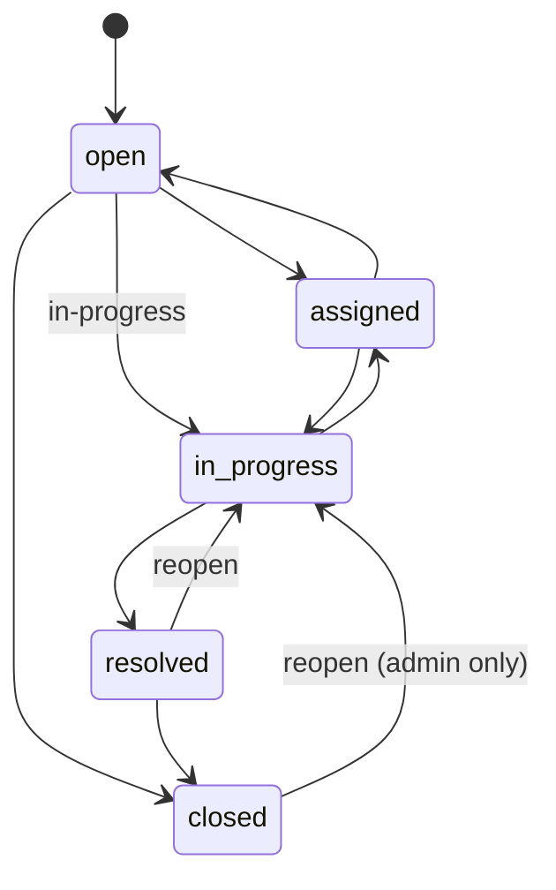

# API Documentation

The complete, interactive reference is served by the app itself at **`/api/docs`** (Swagger UI), and the machine-readable OpenAPI 3.1 document is at **`/api/openapi.json`** (source: [`src/server/openapi.json`](../src/server/openapi.json)). Use **Try it out** with the demo accounts below.

The spec is not just documentation: [`openapi.contract.test.js`](../src/server/__tests__/openapi.contract.test.js) validates every real response against its schemas, so the docs and the API cannot drift apart without a test failing.

This page covers the behaviour that is easiest to miss.

Base URL: `/api`

## Authentication

Sign in with `POST /auth/login` to receive a signed bearer token valid for 8 hours.

| Role       | Email              | Password        |
| ---------- | ------------------ | --------------- |
| Admin      | `admin@demo.local` | `AdminPass123!` |
| Technician | `tech@demo.local`  | `TechPass123!`  |
| User       | `user@demo.local`  | `UserPass123!`  |

```http
Authorization: Bearer <token>
```

Failed sign-ins are rate limited per client address (10 per 15 minutes by default). Successful sign-ins are never counted, so switching between demo accounts is always safe.

## Endpoints

| Method | Endpoint           | Auth         | Purpose                                             |
| ------ | ------------------ | ------------ | --------------------------------------------------- |
| GET    | `/health`          | Public       | Liveness: the process is up (no database)           |
| GET    | `/ready`           | Public       | Readiness: the database answers; version and commit |
| POST   | `/auth/login`      | Public       | Sign in with demo credentials                       |
| GET    | `/auth/me`         | Bearer token | Return the current session                          |
| GET    | `/auth/demo-users` | Public       | List seeded demo accounts                           |
| GET    | `/tickets`         | Bearer token | List tickets with filters, sorting and pagination   |
| GET    | `/tickets/export`  | Bearer token | Export visible tickets as CSV                       |
| GET    | `/tickets/stats`   | Bearer token | Dashboard, priority and SLA stats                   |
| GET    | `/tickets/:id`     | Bearer token | Fetch one visible ticket                            |
| POST   | `/tickets`         | Bearer token | Create a ticket                                     |
| PATCH  | `/tickets/:id`     | Bearer token | Update ticket fields                                |
| DELETE | `/tickets/:id`     | Admin only   | Delete a ticket                                     |

## Errors and request ids

Every response carries an `x-request-id` header. Send your own (letters, digits, `.`, `_`, `-`, up to 64 characters) to trace a specific request; otherwise one is generated. Every error body has the same shape and repeats the id:

```json
{
  "message": "Title must be 120 characters or fewer.",
  "errors": [{ "field": "title", "message": "Title must be 120 characters or fewer." }],
  "requestId": "0b6f2d0e-6a55-4a2b-9e4f-1f0c3f3f5d11"
}
```

| Status | Meaning                                                                                                                 |
| ------ | ----------------------------------------------------------------------------------------------------------------------- |
| 400    | Validation failed; `errors` names the field                                                                             |
| 401    | Missing, expired or invalid token                                                                                       |
| 403    | Signed in but not permitted (for example a requester editing status)                                                    |
| 409    | The change conflicts with the ticket's state: an illegal status move, or a stale `If-Match` version                     |
| 503    | In production, `AUTH_SECRET` is missing or shorter than 32 characters: sign-in and authenticated routes are unavailable |
| 404    | No such ticket, or one a requester may not see                                                                          |
| 409    | A unique value already exists                                                                                           |
| 429    | Too many failed sign-in attempts                                                                                        |
| 503    | The database is not configured or not reachable                                                                         |

Unexpected errors return a generic 500; details stay in the server log, where the request id finds them ([RUNBOOK.md](RUNBOOK.md)).

## Ticket workflow



The transition table is `statusTransitions` in [`src/shared/ticket-constants.json`](../src/shared/ticket-constants.json). The API enforces it ([`ticketWorkflow.js`](../src/server/domain/ticketWorkflow.js)) and the status menu offers only the moves it allows. A move the table does not list returns `409`; reopening a closed ticket without the admin role returns `403`. Sending the ticket's current status is accepted and changes nothing.

Default SLA windows, measured from when the ticket was created:

| Priority | SLA      |
| -------- | -------- |
| `urgent` | 4 hours  |
| `high`   | 24 hours |
| `medium` | 48 hours |
| `low`    | 72 hours |

- Changing priority recalculates the due date unless `dueAt` is sent in the same request.
- `resolved` and `closed` are terminal: they stop the SLA clock. Resolving stamps `resolvedAt`, closing keeps it, reopening clears it and logs `ticket_reopened`.
- Moving a ticket to `assigned` requires an assignee.
- Tickets get a human-friendly number such as `TKT-0001`. Route parameters use the MongoDB `_id`.

## Editing a ticket safely

Every ticket carries a version, `__v`, that increases by one on each update. `PATCH /tickets/:id` returns the new version in the body and in an `ETag` header.

- **Send `If-Match: "<version>"`** with the version you loaded. If the ticket has changed since, the API answers `409` and writes nothing, so you cannot overwrite an edit you have not seen. The web app does this on every edit and reloads the list on a `409`.
- **Without `If-Match`** the update is applied to the latest version. Each update is a single atomic write guarded by the version it was computed from; if another write lands first, the update is recomputed against the new state (up to three attempts), so the `from` value in the activity log is always the real previous value.
- `If-Match` accepts `"3"`, `W/"3"` or `3`. `*` means any current version. Anything else is a `400`.

## Who can do what

| Action                                        | Admin | Technician | Requester        |
| --------------------------------------------- | ----- | ---------- | ---------------- |
| See the whole queue                           | Yes   | Yes        | Own tickets only |
| Create a ticket                               | Yes   | Yes        | Yes              |
| Change status, assignee, due date             | Yes   | Yes        | No               |
| Change title, description, priority, category | Yes   | Yes        | Own tickets only |
| Delete a ticket                               | Yes   | No         | No               |

A requester asking for someone else's ticket gets `404`, not `403`, so ids cannot be probed. Tickets a requester creates always carry their identity, `open` status and `Unassigned` owner, whatever the request says.

## Listing tickets

`GET /tickets` supports:

| Query        | Description                                                                                                                                         |
| ------------ | --------------------------------------------------------------------------------------------------------------------------------------------------- |
| `page`       | Page number, `1` to `100000`                                                                                                                        |
| `limit`      | Page size, `1` to `100` (default 10)                                                                                                                |
| `sortBy`     | `ticketNumber`, `title`, `status`, `priority`, `assignee`, `dueAt`, `createdAt` or `updatedAt`                                                      |
| `sortOrder`  | `asc` or `desc`                                                                                                                                     |
| `status`     | `open`, `assigned`, `in-progress`, `resolved` or `closed`                                                                                           |
| `priority`   | `low`, `medium`, `high` or `urgent`                                                                                                                 |
| `assignedTo` | Case-insensitive assignee match                                                                                                                     |
| `search`     | Case-insensitive text search across number, title, description, requester, assignee and category. It is matched as literal text, never as a pattern |
| `sla`        | `breached` or `due-soon`. Combines with `status`; a resolved or closed status matches nothing                                                       |

- Sorting by `priority` ranks by severity: descending gives urgent, high, medium, low.
- Ties are broken by `_id`, so pages are stable.
- Unknown filter values and non-text values (such as `search[$ne]=x`) are rejected with `400`.

```http
GET /api/tickets?page=1&limit=10&sortBy=priority&sortOrder=desc&status=open&sla=breached
```

The response has `data` (the rows), `pagination` (`page`, `limit`, `total`, `totalPages`), and `tickets`, a deprecated copy of `data` kept for older clients.

## CSV export

`GET /tickets/export` takes the same filters as the list, ignores paging, and returns at most 10,000 rows scoped to what the caller may see.

```text
Ticket ID, Title, Status, Priority, Requester, Assigned To, Created At, Updated At, SLA Due At, SLA Breached
```

Text a requester controls can be exported by an admin, so cells beginning with `=`, `+`, `-`, `@`, tab or carriage return are prefixed with an apostrophe to stop spreadsheets running them as formulas.

## Activity history

Ticket responses include an `activity` array. Every change to status, priority or assignee appends an entry in the same database update as the change:

```json
{
  "action": "status_changed",
  "from": "assigned",
  "to": "in-progress",
  "actorName": "Theo Technician",
  "actorRole": "technician",
  "actorEmail": "tech@demo.local",
  "createdAt": "2026-07-01T12:00:00.000Z"
}
```

## Example

```bash
TOKEN=$(curl -s http://localhost:5000/api/auth/login \
  -H "Content-Type: application/json" \
  -d '{"email":"admin@demo.local","password":"AdminPass123!"}' | jq -r .token)

curl "http://localhost:5000/api/tickets?sortBy=priority&sortOrder=desc&limit=5" \
  -H "Authorization: Bearer $TOKEN" \
  -H "x-request-id: my-trace-1"
```
