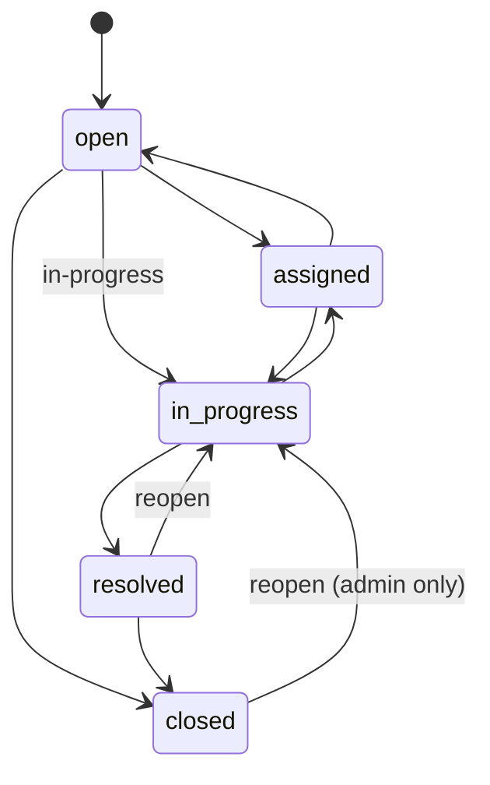

# API Documentation

The complete, interactive reference is served by the app itself at **`/api/docs`** (Swagger UI), and the machine-readable OpenAPI 3.1 document is at **`/api/openapi.json`** (source: [`src/server/openapi.json`](../src/server/openapi.json)). Use **Try it out** with the demo accounts below.

The spec is not just documentation: [`openapi.contract.test.ts`](../src/server/__tests__/openapi.contract.test.ts) validates every real response against its schemas, so the docs and the API cannot drift apart without a test failing.

This page covers the behaviour that is easiest to miss.

Base URL: `/api`

## Authentication

Sign in with `POST /auth/login` to receive a **15-minute access token** and the user. Send the token on every request:

```http
Authorization: Bearer <token>
```

The response also sets a `rt` **refresh cookie** (`HttpOnly`, `SameSite=Strict`, `Secure` over https, scoped to `/api/auth`). When the access token expires, `POST /auth/refresh` trades the cookie for a new token and a new cookie. A refresh token works **once**: presenting one that was already used means a copy exists, so the whole session is ended. `POST /auth/logout` ends it on purpose. Browsers do this automatically; a script using the API just signs in again when its token expires. Both cookie endpoints refuse a request that names a different `Origin`.

The demo users below are created the first time anyone signs in (their passwords are stored as argon2id hashes like any other user's):

| Role       | Email              | Password        |
| ---------- | ------------------ | --------------- |
| Admin      | `admin@demo.local` | `AdminPass123!` |
| Technician | `tech@demo.local`  | `TechPass123!`  |
| User       | `user@demo.local`  | `UserPass123!`  |

Failed sign-ins are rate limited per client address (10 per 15 minutes by default). Successful sign-ins are never counted, so switching between demo accounts is always safe.

## Endpoints

| Method | Endpoint                | Auth          | Purpose                                                           |
| ------ | ----------------------- | ------------- | ----------------------------------------------------------------- |
| GET    | `/health`               | Public        | Liveness: the process is up (no database)                         |
| GET    | `/ready`                | Public        | Readiness: the database answers; version and commit               |
| GET    | `/metrics`              | Metrics token | Prometheus metrics (off unless `METRICS_TOKEN` is set)            |
| POST   | `/auth/login`           | Public        | Sign in; returns an access token and sets the `rt` cookie         |
| POST   | `/auth/refresh`         | Cookie        | Trade the refresh cookie for a new access token                   |
| POST   | `/auth/logout`          | Cookie        | End the session and clear the cookie                              |
| GET    | `/auth/me`              | Bearer token  | Return the current session                                        |
| GET    | `/auth/demo-users`      | Public        | List seeded demo accounts                                         |
| GET    | `/tickets`              | Bearer token  | List tickets with filters, sorting and pagination                 |
| GET    | `/tickets/export`       | Bearer token  | Export visible tickets as CSV                                     |
| GET    | `/tickets/stats`        | Bearer token  | Dashboard, priority and SLA stats                                 |
| GET    | `/tickets/stats/trends` | Bearer token  | Opened and resolved per day, mean time to resolve, SLA compliance |
| GET    | `/tickets/:id`          | Bearer token  | Fetch one visible ticket                                          |
| POST   | `/tickets`              | Bearer token  | Create a ticket                                                   |
| PATCH  | `/tickets/:id`          | Bearer token  | Update ticket fields                                              |
| DELETE | `/tickets/:id`          | Admin only    | Delete a ticket (and its comments)                                |
| GET    | `/tickets/:id/comments` | Bearer token  | A ticket's comments, oldest first                                 |
| POST   | `/tickets/:id/comments` | Bearer token  | Add a comment, or an internal note (staff only)                   |
| GET    | `/users`                | Admin only    | List users (never their password hashes)                          |
| PATCH  | `/users/:id`            | Admin only    | Change a user's role                                              |
| GET    | `/audit`                | Admin only    | Read the security audit log                                       |
| GET    | `/outbox`               | Admin only    | List events waiting to be sent to the webhook                     |
| POST   | `/outbox/:id/retry`     | Admin only    | Put a dead event back in the queue                                |
| POST   | `/jobs/sla-escalation`  | Job secret    | Mark tickets that reached an SLA milestone                        |
| POST   | `/jobs/outbox-delivery` | Job secret    | Send due events to the webhook                                    |

## Administration

`GET /users` lists every user (`id`, `name`, `email`, `role`, `createdAt`). `PATCH /users/:id` with `{ "role": "admin" | "technician" | "user" }` changes a role.

- **There must always be at least one admin.** Demoting the last one is a `409` with code `LAST_ADMIN`, even when two admins demote each other at the same moment (it runs in a transaction that makes concurrent demotions conflict).
- A role change **ends the user's sessions**, so it applies at their next refresh. An access token already issued keeps its old role until it expires, at most 15 minutes.
- Technicians and requesters get `403`, and the denial is recorded.

`GET /audit` returns security events newest first, with `type` (one of `login_success`, `login_failure`, `logout`, `refresh_reuse`, `role_changed`, `ticket_deleted`, `permission_denied`), `page` and `limit`. Each event carries the actor, address, user agent, outcome, and the `requestId` that matches the server log. It is read-only: no endpoint writes or deletes events.

## Errors and request ids

Every response carries an `x-request-id` header. Send your own (letters, digits, `.`, `_`, `-`, up to 64 characters) to trace a specific request; otherwise one is generated. Every error body has the same shape and repeats the id:

```json
{
  "message": "Title must be 120 characters or fewer.",
  "code": "VALIDATION_FAILED",
  "errors": [{ "field": "title", "message": "Title must be 120 characters or fewer." }],
  "requestId": "0b6f2d0e-6a55-4a2b-9e4f-1f0c3f3f5d11"
}
```

`message` is written for people and may change. **Branch on `code`**, which is stable:

| Status | `code`                    | Meaning                                                                                         |
| ------ | ------------------------- | ----------------------------------------------------------------------------------------------- |
| 400    | `VALIDATION_FAILED`       | The request is malformed or breaks a rule; `errors` names the field                             |
| 401    | `UNAUTHORIZED`            | Missing, expired or invalid token, or wrong credentials                                         |
| 403    | `FORBIDDEN`               | Signed in but not permitted (a requester editing status, a non-admin reopening a closed ticket) |
| 404    | `NOT_FOUND`               | No such ticket (or one a requester may not see), or no such route                               |
| 409    | `INVALID_TRANSITION`      | The status move is not allowed from the ticket's current status                                 |
| 409    | `VERSION_CONFLICT`        | The `If-Match` version is no longer current: someone else changed the ticket                    |
| 409    | `LAST_ADMIN`              | The change would leave no admin                                                                 |
| 409    | `DUPLICATE`               | A unique value already exists                                                                   |
| 429    | `RATE_LIMITED`            | Too many failed sign-in attempts                                                                |
| 503    | `AUTH_NOT_CONFIGURED`     | In production `AUTH_SECRET` is missing or shorter than 32 characters                            |
| 503    | `JOBS_NOT_CONFIGURED`     | `CRON_SECRET` is missing or shorter than 32 characters, so the scheduled jobs are off           |
| 503    | `DATABASE_NOT_CONFIGURED` | `MONGODB_URI` is not set                                                                        |
| 503    | `DATABASE_UNAVAILABLE`    | The database cannot be reached                                                                  |
| 500    | `INTERNAL_ERROR`          | Unexpected; details stay in the server log                                                      |

Unexpected errors return a generic message; details stay in the server log, where the request id finds them ([RUNBOOK.md](RUNBOOK.md)).

## Ticket workflow



The transition table is `statusTransitions` in [`src/shared/ticket-constants.ts`](../src/shared/ticket-constants.ts). The API enforces it ([`ticketWorkflow.ts`](../src/server/domain/ticketWorkflow.ts)) and the status menu offers only the moves it allows. A move the table does not list returns `409`; reopening a closed ticket without the admin role returns `403`. Sending the ticket's current status is accepted and changes nothing.

Default SLA windows, measured from when the ticket was created:

| Priority | SLA      |
| -------- | -------- |
| `urgent` | 4 hours  |
| `high`   | 24 hours |
| `medium` | 48 hours |
| `low`    | 72 hours |

- Changing priority recalculates the due date unless `dueAt` is sent in the same request.
- `resolved` and `closed` are terminal: they stop the SLA clock. Resolving stamps `resolvedAt`, closing keeps it, reopening clears it and logs `ticket_reopened`.
- Moving a ticket to `assigned` requires an assignee.
- Tickets get a human-friendly number such as `TKT-0001`. Route parameters use the MongoDB `_id`.

## Editing a ticket safely

Every ticket carries a version, `__v`, that increases by one on each update. `PATCH /tickets/:id` returns the new version in the body and in an `ETag` header.

- **Send `If-Match: "<version>"`** with the version you loaded. If the ticket has changed since, the API answers `409` and writes nothing, so you cannot overwrite an edit you have not seen. The web app does this on every edit and reloads the list on a `409`.
- **Without `If-Match`** the update is applied to the latest version. Each update is a single atomic write guarded by the version it was computed from; if another write lands first, the update is recomputed against the new state (up to three attempts), so the `from` value in the activity log is always the real previous value.
- `If-Match` accepts `"3"`, `W/"3"` or `3`. `*` means any current version. Anything else is a `400`.
- **`X-Ticket-Version: 3` means the same thing, and is what the web app sends.** Some hosts answer `If-Match` themselves: Vercel compares it with the response's `ETag`, so a successful edit (whose `ETag` is the new version) came back as `412` after it had been saved. Use `X-Ticket-Version` when the API is behind such a host; if both headers are sent it wins.

## Comments and internal notes

`POST /tickets/:id/comments` takes `{ "body": "...", "visibility": "public" | "internal" }` (visibility defaults to `public`; the body is 1 to 2,000 characters). Staff can post either kind; a requester who sends `internal` gets `403`. `GET /tickets/:id/comments` returns the thread oldest first.

**A requester never receives an internal note.** The server applies the rule: the comments query only asks the database for the visibilities the caller may read, and the history entry recorded for a note (`comment_added`, marked `internal`) is removed from every ticket a requester is sent (the list, one ticket, and the response to their own edit or create). The entry never repeats the note's text. The CSV export contains no comments. Comments live in their own collection, so a busy thread cannot grow a ticket document, and adding one does not change the ticket's version (it will not make someone else's edit fail with a `409`).

## Trends

`GET /tickets/stats/trends?days=30&tz=America/Toronto` returns, for the tickets the caller may see:

- `series`: one entry per calendar day, oldest first, with `opened` (tickets created that day) and `resolved` (tickets resolved or closed that day). Days with nothing are zeros.
- `resolution.meanHours`: the mean time from creation to resolution over tickets resolved in the window, to one decimal place. `null` when nothing was resolved.
- `sla.compliancePercent`: the share of those tickets resolved on or before their SLA deadline. `null` when nothing was resolved.

`days` is 1 to 90 (default 30). `tz` is an IANA time zone name (default `UTC`) and decides where a day ends; an unknown name is a `400`. A ticket that is reopened and resolved again counts on the day of its latest resolution.

## SLA escalation and notifications

Two scheduled jobs, called with `Authorization: Bearer <CRON_SECRET>` (not a user token):

- `POST /jobs/sla-escalation` looks at unresolved tickets. One **past its deadline** gets `slaBreachedAt` and its priority raised one step (an urgent ticket is only marked); one **within 24 hours** of its deadline gets `slaAtRiskAt`. Each step writes a history entry by `SLA automation` (`actorRole: "system"`) and bumps the ticket version, and happens once per ticket: the markers make a second run change nothing. The deadline (`dueAt`) is deliberately **not** recomputed, so a breached ticket keeps showing how late it is; this is the one exception to "a priority change resets the deadline". Response: `{ "breached": 1, "atRisk": 2, "more": false }`.
- `POST /jobs/outbox-delivery` sends due events to `WEBHOOK_URL`. Response: `{ "configured": true, "delivered": 3, "retried": 0, "dead": 0 }`; `configured: false` means no webhook is set and nothing was done.

The events are `ticket.created`, `ticket.status_changed`, `ticket.assigned`, `ticket.comment_added`, `ticket.sla_at_risk` and `ticket.sla_breached`. Each is recorded in the same transaction as the change, sent at least once, and retried with exponential backoff (about 30 s, 1, 2, 4 and 8 minutes) up to six attempts, then marked `dead`. Statuses: `pending`, `sending`, `delivered`, `dead`. Delivered events are removed after 14 days (`OUTBOX_RETENTION_DAYS`); dead ones stay until an admin retries them (`POST /outbox/:id/retry`). With no `WEBHOOK_URL`, nothing is recorded or sent.

## Who can do what

| Action                                        | Admin | Technician | Requester        |
| --------------------------------------------- | ----- | ---------- | ---------------- |
| See the whole queue                           | Yes   | Yes        | Own tickets only |
| Create a ticket                               | Yes   | Yes        | Yes              |
| Change status, assignee, due date             | Yes   | Yes        | No               |
| Change title, description, priority, category | Yes   | Yes        | Own tickets only |
| Delete a ticket                               | Yes   | No         | No               |
| Read and write public comments                | Yes   | Yes        | Own tickets only |
| Read and write internal notes                 | Yes   | Yes        | No               |

A requester asking for someone else's ticket gets `404`, not `403`, so ids cannot be probed. Tickets a requester creates always carry their identity, `open` status and `Unassigned` owner, whatever the request says.

## Listing tickets

`GET /tickets` supports:

| Query        | Description                                                                                                                                             |
| ------------ | ------------------------------------------------------------------------------------------------------------------------------------------------------- |
| `page`       | Page number, `1` to `100000`                                                                                                                            |
| `limit`      | Page size, `1` to `100` (default 10)                                                                                                                    |
| `sortBy`     | `ticketNumber`, `title`, `status`, `priority`, `assignee`, `dueAt`, `createdAt` or `updatedAt`. Default: `createdAt`, or best match first with `search` |
| `sortOrder`  | `asc` or `desc`                                                                                                                                         |
| `status`     | `open`, `assigned`, `in-progress`, `resolved` or `closed`                                                                                               |
| `priority`   | `low`, `medium`, `high` or `urgent`                                                                                                                     |
| `assignedTo` | Case-insensitive assignee match                                                                                                                         |
| `search`     | Full-text search across number, title, description, requester, assignee and category. See below                                                         |
| `sla`        | `breached` or `due-soon`. Combines with `status`; a resolved or closed status matches nothing                                                           |

- Sorting by `priority` ranks by severity: descending gives urgent, high, medium, low.
- **Search matches whole words, not fragments.** `connecting` finds "Cannot connect to Wi-Fi", but `conn` and `prin` do not find "connect" or "printer". A hit in the title or ticket number ranks above one in the description, and with no `sortBy` the best match comes first. Case is ignored.
- **Ticket numbers match by prefix.** `TKT-0012`, `tkt-00` and `TKT` are read as ticket numbers, not words.
- Search is plain words: a leading `-` (which would exclude a word) and quotes (which would demand a phrase) are stripped, and regular-expression characters are just text.
- Ties are broken by `_id`, so pages are stable.
- Unknown filter values and non-text values (such as `search[$ne]=x`) are rejected with `400`.

```http
GET /api/tickets?page=1&limit=10&sortBy=priority&sortOrder=desc&status=open&sla=breached
```

The response has `data` (the rows), `pagination` (`page`, `limit`, `total`, `totalPages`), and `tickets`, a deprecated copy of `data` kept for older clients.

## CSV export

`GET /tickets/export` takes the same filters and ordering as the list, ignores paging, and returns every matching row the caller may see. The body is streamed in chunks (`Transfer-Encoding: chunked`) from a database cursor, so the size of an export does not affect the server's memory.

```text
Ticket ID, Title, Status, Priority, Requester, Assigned To, Created At, Updated At, SLA Due At, SLA Breached
```

Text a requester controls can be exported by an admin, so cells beginning with `=`, `+`, `-`, `@`, tab or carriage return are prefixed with an apostrophe to stop spreadsheets running them as formulas.

## Activity history

Ticket responses include an `activity` array. Every change to status, priority or assignee appends an entry in the same database update as the change:

```json
{
  "action": "status_changed",
  "from": "assigned",
  "to": "in-progress",
  "actorName": "Theo Technician",
  "actorRole": "technician",
  "actorEmail": "tech@demo.local",
  "createdAt": "2026-07-01T12:00:00.000Z"
}
```

## Example

```bash
TOKEN=$(curl -s http://localhost:5000/api/auth/login \
  -H "Content-Type: application/json" \
  -d '{"email":"admin@demo.local","password":"AdminPass123!"}' | jq -r .token)

curl "http://localhost:5000/api/tickets?sortBy=priority&sortOrder=desc&limit=5" \
  -H "Authorization: Bearer $TOKEN" \
  -H "x-request-id: my-trace-1"
```
