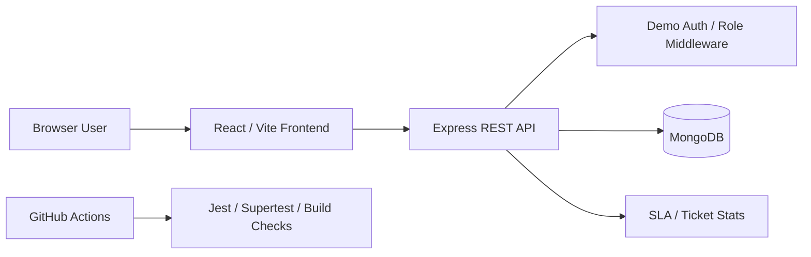

# Architecture

## High-Level Architecture

The application uses a React/Vite frontend, an Express REST API, and MongoDB through Mongoose. The same Express app can serve local API routes, Docker deployments, and Vercel serverless adapters.



## Frontend Responsibilities

- Render login, dashboard, ticket form, filters, and role-aware controls.
- Store the demo bearer token in local storage.
- Send authenticated API requests.
- Show loading, success, and error states.
- Disable controls that are not available to the current role.

## Backend Responsibilities

- Authenticate signed demo bearer tokens.
- Enforce role-based permissions.
- Validate ticket input.
- Scope ticket visibility by requester for user accounts.
- Calculate SLA and ticket dashboard stats.
- Return consistent JSON errors.

## Database Responsibilities

- Store ticket documents.
- Apply schema defaults and validation.
- Track ticket timestamps and activity entries.
- Support common dashboard filters through indexes.

## Request Flow

1. User signs in through `POST /api/auth/login`.
2. API returns a signed bearer token and public user object.
3. Frontend sends `Authorization: Bearer <token>` on protected requests.
4. Express middleware verifies the token and attaches `req.user`.
5. Ticket routes apply role scope, validate input, and query MongoDB.
6. Frontend renders the response or a clear error message.

## Authentication Flow

Demo credentials are checked against the in-code demo users. Successful login returns a signed token with user ID, name, email, role, and expiry. Protected routes reject missing, expired, malformed, or tampered tokens.

## Ticket Workflow

Supported ticket statuses:

```text
open -> assigned -> in-progress -> resolved -> closed
```

Resolved and closed tickets are treated as terminal for SLA breach calculations.

## Role Permissions

| Action           | Admin | Technician | User |
| ---------------- | ----- | ---------- | ---- |
| View full queue  | Yes   | Yes        | No   |
| View own tickets | Yes   | Yes        | Yes  |
| Create ticket    | Yes   | Yes        | Yes  |
| Update workflow  | Yes   | Yes        | No   |
| Update priority  | Yes   | Yes        | Yes  |
| Delete ticket    | Yes   | No         | No   |

## Deployment Model

- Local development uses Vite and the Express API together through `npm run dev`.
- Docker builds the frontend and serves frontend assets from Express.
- Vercel deployment uses the `api/` adapter files for serverless functions and the Vite build output for static assets.

## Test Strategy

- Jest verifies auth helpers and API route behavior.
- Supertest exercises protected API endpoints without a browser.
- CI runs formatting, tests, build, and a non-blocking audit.
- Future Playwright tests should cover login, role permissions, ticket workflow, and screenshot capture.
