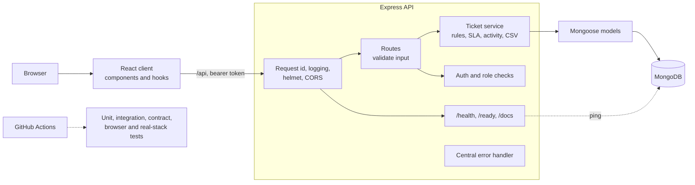
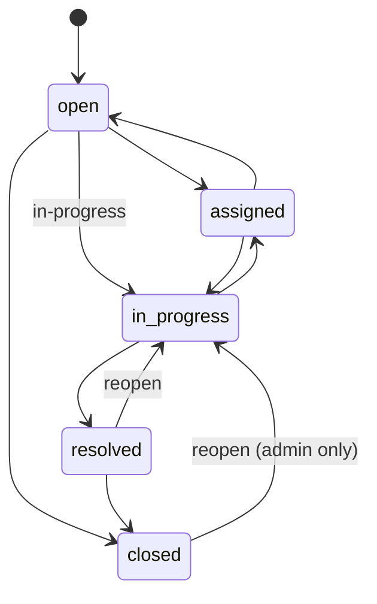

# Architecture

## Overview

A React single-page app talks to an Express REST API, which stores tickets in MongoDB through Mongoose. The same Express app runs locally, in a Docker container, and as Vercel serverless functions.

```mermaid
flowchart LR
  User[Browser] --> Client[React client<br/>components and hooks]
  Client -->|/api, bearer token| Edge

  subgraph API[Express API]
    direction TB
    Edge[Request id, logging,<br/>helmet, CORS] --> Routes[Routes<br/>validate input]
    Routes --> Services[Ticket service<br/>rules, SLA, activity, CSV]
    Routes --> Auth[Auth and role checks]
    Edge --> Ops["/health, /ready, /docs"]
    Errors[Central error handler]
  end

  Services --> Models[Mongoose models]
  Models --> DB[(MongoDB)]
  Ops -.->|ping| DB
  CI[GitHub Actions] -.-> Tests[Unit, integration, contract,<br/>browser and real-stack tests]
```

## Backend

`src/server` is layered so each part has one job:

| Layer              | Files                                 | Responsibility                                                             |
| ------------------ | ------------------------------------- | -------------------------------------------------------------------------- |
| App and middleware | `app.js`, `logger.js`, `middleware/`  | Request id and structured logs, security headers, CORS, error handling     |
| Routes             | `routes/auth.js`, `routes/tickets.js` | Translate HTTP: validate input, call a service, shape the response         |
| Validation         | `validation/tickets.js`               | Zod schemas: the one place input is trimmed, coerced, bounded and rejected |
| Services           | `services/ticketService.js`           | Business rules: role scoping, filters, SLA, timestamps, activity log, CSV  |
| Models             | `models/`                             | Mongoose schemas, defaults, indexes                                        |
| Auth               | `auth.js`                             | Signed tokens and role middleware                                          |
| Shared constants   | `src/shared/ticket-constants.json`    | Statuses, priorities, SLA windows: read by the API, the models and the UI  |
| API contract       | `openapi.json`, `docs.js`             | OpenAPI 3.1 document and the Swagger UI that serves it                     |

Errors are thrown as `HttpError` (or by Mongoose) and leave through one handler, so every failure has the same JSON shape and a request id.

## Frontend

`src/client` keeps state in hooks and rendering in small components:

- `hooks/useAuth`: who is signed in; restores a saved session; reacts to an expired token.
- `hooks/useTickets`: the ticket page and stats, filters, debounced search, and the create, update, delete and export actions. Requests are cancelled when superseded, so a slow response cannot overwrite a newer one.
- `hooks/useNotices`, `hooks/useDebouncedValue`: the alert banner and the search delay.
- `components/`: header, demo accounts, stats, form, filters, table, row, activity timeline, pagination, alert.
- `api.js`: the only place that calls `fetch`. It attaches the token, turns failures into `ApiError` (carrying the request id) and signs the user out on `401`.

## Request flow

1. The user signs in with `POST /api/auth/login` and receives a signed token and the public user.
2. The client sends `Authorization: Bearer <token>` on later requests.
3. The request gets an id, is logged, and passes the security headers.
4. `requireAuth` verifies the token and attaches `req.user`.
5. The route validates the input with Zod.
6. The ticket service applies the role scope, runs the query or change, and records activity.
7. The response, or the error with its request id, goes back to the client.

## Authentication

Demo credentials are checked against in-code demo users. A successful sign-in returns an HMAC-signed token containing the user id, name, email, role and an 8 hour expiry. Protected routes reject missing, expired, malformed or tampered tokens. See [SECURITY_NOTES.md](SECURITY_NOTES.md) for the limits of this model.

## Ticket workflow

```mermaid
stateDiagram-v2
    [*] --> open
    open --> assigned
    open --> in_progress: in-progress
    open --> closed
    assigned --> in_progress
    assigned --> open
    in_progress --> resolved
    in_progress --> assigned
    resolved --> closed
    resolved --> in_progress: reopen
    closed --> in_progress: reopen (admin only)
```

The transition table is `statusTransitions` in [`src/shared/ticket-constants.json`](../src/shared/ticket-constants.json). The API enforces it ([`ticketWorkflow.js`](../src/server/domain/ticketWorkflow.js)) and the status menu offers only the moves it allows. A move the table does not list returns `409`; reopening a closed ticket without the admin role returns `403`. Sending the ticket's current status is accepted and changes nothing.

Resolved and closed tickets are terminal: they stop the SLA clock. Each priority has an SLA window (urgent 4h, high 24h, medium 48h, low 72h) that sets the due date.

## Deployment

| Where  | How                                                                                                 |
| ------ | --------------------------------------------------------------------------------------------------- |
| Local  | `npm run dev` runs Vite and the API together; `npm run dev:db` starts a throwaway MongoDB           |
| Docker | `docker compose up --build --wait`: a multi-stage, non-root image plus MongoDB, health checked      |
| Vercel | The Vite build is served statically and `api/` adapters run the Express app as serverless functions |

See [DEPLOYMENT.md](../DEPLOYMENT.md) and [RUNBOOK.md](RUNBOOK.md).

## Decisions

- [ADR 001: ticket document model](adr/001-ticket-document-model.md)
- [ADR 002: layered test strategy](adr/002-layered-test-strategy.md)
- [ADR 003: operability and request tracing](adr/003-operability-and-request-tracing.md)
