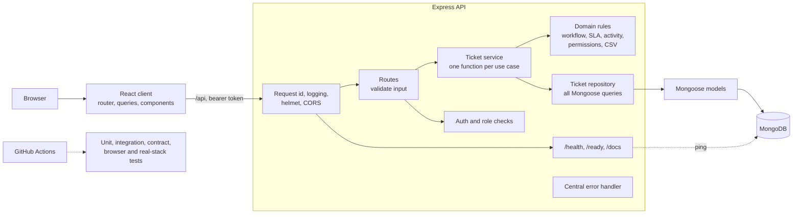
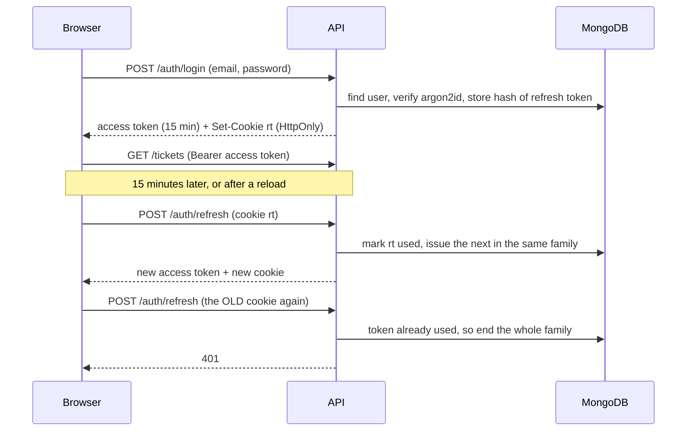
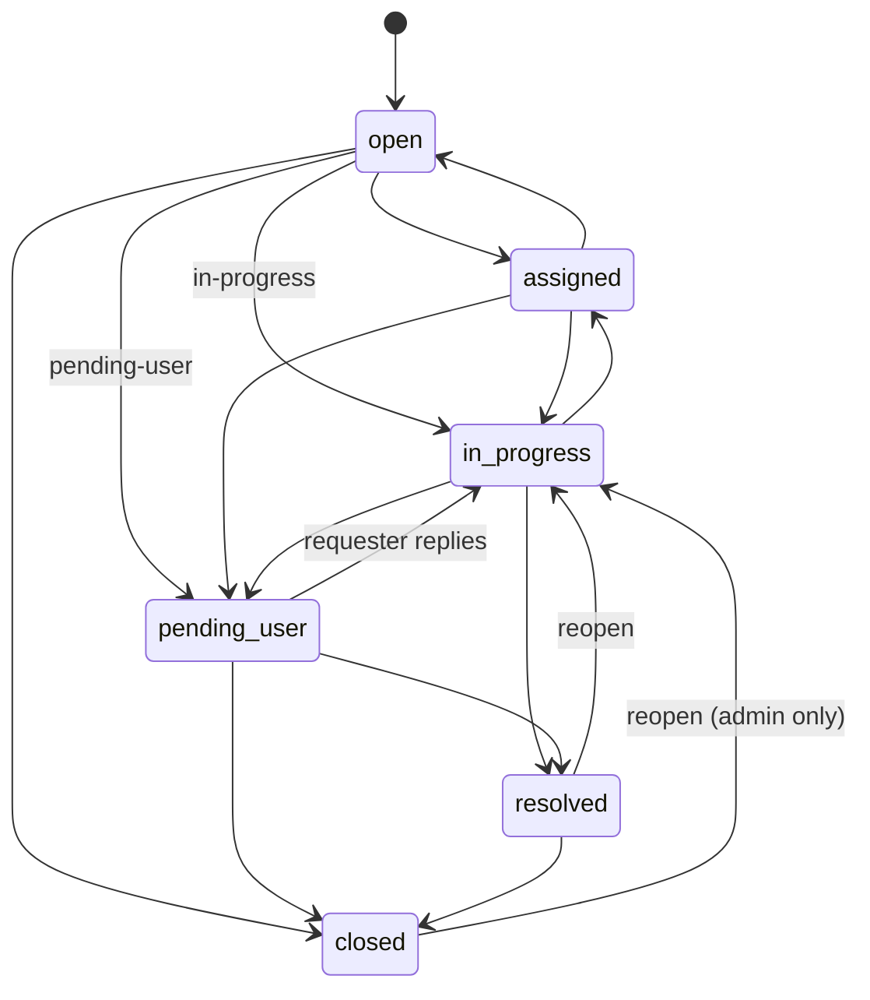

# Architecture

## Overview

A React single-page app talks to an Express REST API, which stores tickets in MongoDB through Mongoose. The same Express app runs locally, in a Docker container, and as Vercel serverless functions.

```mermaid
flowchart LR
  User[Browser] --> Client[React client<br/>router, queries, components]
  Client -->|/api, bearer token| Edge

  subgraph API[Express API]
    direction TB
    Edge[Request id, logging,<br/>helmet, CORS] --> Routes[Routes<br/>validate input]
    Routes --> Services[Ticket service<br/>one function per use case]
    Routes --> Auth[Auth and role checks]
    Services --> Domain[Domain rules<br/>workflow, SLA, activity,<br/>permissions, CSV]
    Services --> Repo[Ticket repository<br/>all Mongoose queries]
    Edge --> Ops["/health, /ready, /docs"]
    Errors[Central error handler]
  end

  Repo --> Models[Mongoose models]
  Models --> DB[(MongoDB)]
  Ops -.->|ping| DB
  CI[GitHub Actions] -.-> Tests[Unit, integration, contract,<br/>browser and real-stack tests]
```

## Backend

The API is TypeScript (`strict`). `tsc` compiles it to `dist-server/`, which is what `npm start`, the Docker image and the Vercel functions run; `tsx` runs the same sources in development. `src/server` is layered so each part has one job, and dependencies point one way, down the table:

| Layer              | Files                                 | Responsibility                                                                                                                 |
| ------------------ | ------------------------------------- | ------------------------------------------------------------------------------------------------------------------------------ |
| App and middleware | `app.ts`, `logger.ts`, `middleware/`  | Request id and structured logs, security headers, CORS, error handling                                                         |
| Routes             | `routes/auth.ts`, `routes/tickets.ts` | Translate HTTP: parse input, call a service, shape the response (and stream the CSV)                                           |
| Validation         | `validation/tickets.ts`               | Turns untrusted input into a typed value, or a 400 naming the field                                                            |
| Services           | `services/ticketService.ts`           | One function per use case: check the caller, apply domain rules, persist through the repository                                |
| Domain             | `domain/`                             | Pure rules with no framework or database: workflow, SLA and timestamps, activity, permissions, CSV, comment visibility, trends |
| Repositories       | `repositories/ticketRepository.ts`    | The only code that queries Mongoose. Takes criteria and change objects, so nothing above knows Mongo                           |
| Models             | `models/`                             | Mongoose schemas, defaults, indexes: tickets (with the text index behind search), users, refresh tokens, audit events          |
| Auth and security  | `auth.ts`, `security/`                | `requireAuth` and role middleware; access tokens (`jose`), argon2id passwords, the refresh cookie                              |
| Shared             | `src/shared/`                         | `ticket-constants.ts` (statuses, transitions, SLA windows), `schemas.ts` (Zod), `ticket-types.ts`                              |
| API contract       | `openapi.json`, `docs.ts`             | OpenAPI 3.1 document and the Swagger UI that serves it                                                                         |

`architecture.test.ts` enforces the boundaries against the real import statements: routes cannot reach the database, services cannot import Mongoose, and the domain cannot import a framework. The domain layer also has an ESLint import restriction, so a violation shows in the editor before the test runs. (TypeScript is pinned to 6.x because `typescript-eslint`, which lints all the TypeScript, does not support 7 yet.)

**Transactions and the outbox.** A ticket create or edit, a comment, and the notification event that describes them are written in one MongoDB transaction (`repositories/transaction.ts`; MongoDB must be a replica set, as Atlas is), so an event exists if and only if its change committed. A separate delivery step (`services/outboxService.ts`) sends events to the webhook afterwards, claiming each one atomically so several workers never send the same event twice, retrying with exponential backoff and jitter, and marking an event dead after six attempts. **Scheduled jobs** (`routes/jobs.ts`, behind the `CRON_SECRET` bearer token) run SLA escalation (`services/slaService.ts`, rules in `domain/slaEscalation.ts`, idempotent through markers on the ticket) and delivery; GitHub Actions calls them every 30 minutes, or the Compose `worker` runs them on a timer.

**The service desk agent.** A second consumer of the outbox: a new ticket writes an event for the agent in the same transaction ([ADR 010](adr/010-agent-worker-and-outbox-consumer.md)), and a worker (`services/agentWorkerService.ts`, run by `POST /api/jobs/agent-runs` or the Compose worker, and started at once on Vercel by `waitUntil`) claims it, records a run, mints a token for that one run and ticket, and runs the loop in `src/server/agent/`. The agent is a client of the API ([ADR 009](adr/009-agent-as-api-client.md)): it may not import the database, models, repositories, services, routes, middleware or security code, and `architecture.test.ts` checks that. Its tools call the ordinary endpoints; the model behind them is a small interface (`ModelClient`), with the Anthropic SDK, a scripted client for tests and a replay of recordings behind it. Runs, steps and settings are their own collections. What the agent may do depends on the mode ([ADR 011](adr/011-agent-rollout-shadow-assist-auto.md)): in assist it triages for real (a `PATCH` guarded by the version it read, stepping back if a person edits the ticket) and hands over through `POST /agent/escalations`, and its drafted reply is kept on the run until a person approves, edits or rejects it (`services/proposalService.ts`), which posts it as a comment marked as the agent's and moves the ticket to `pending-user` in one transaction. A reply may only cite articles the agent read in full in that run, enforced by the tool registry ([ADR 012](adr/012-server-side-citation-enforcement.md)). The web app shows staff a panel with the draft on the ticket, and admins an Agent page (`/admin/agent`) with the kill switch, per-category modes, limits and the runs. `npm run eval` runs 108 golden tickets through all of this against a throwaway local database (`scripts/eval/`).

**Observability.** Every request is timed and counted by `metrics.ts` (Prometheus, labelled by route template) and logged as one structured line with a request id. `GET /api/metrics` is mounted before the database middleware and stays off unless `METRICS_TOKEN` is set. `docker-compose.observability.yml` adds Prometheus and a provisioned Grafana dashboard (`ops/`); a test checks that the dashboard only queries metrics the API exports, and a CI job boots the stack and checks that Prometheus reaches the API and Grafana loads the dashboard. Metrics are per instance, so they describe a container deployment, not serverless.

Errors the API raises on purpose are `AppError` subclasses with an HTTP status and a stable `code` (see [API.md](API.md#errors-and-request-ids)); anything else is logged and returned as a generic 500. Both leave through one handler, so every failure has the same JSON shape and a request id.

## Frontend

`src/client` is strict TypeScript. Server data lives in TanStack Query, the address holds the view, and small components render it:

- `routes.tsx`: React Router routes `/login`, `/tickets`, `/tickets/:id` (with its comment thread), `/trends` (staff), `/admin/users` and `/admin/audit`. `RequireAuth` and `RequireRole` (`auth/guards.tsx`) decide who sees a page; a signed-out visitor is sent to `/login` and back to the page they asked for. On Vercel a rewrite in `vercel.json` serves the app for any non-API path so these addresses survive a reload.
- `auth/AuthContext.tsx`: who is signed in. The access token is kept in memory only; after a reload the refresh cookie is traded for a new one (only tried when this browser signed in before). When a session ends unasked, the user sees why.
- `queries/`: ticket, stats and user queries, keyed by their filters, so a slow response for an old search cannot replace a newer one. The status and priority changes are optimistic: the row updates at once and rolls back if the server refuses, for example on a version conflict, and the server's answer is refetched either way.
- `hooks/useTicketFilters`: filters, sort and page live in the URL search params, so a filtered view can be linked and survives a reload.
- `notices/NoticeContext.tsx`, `hooks/useDebouncedValue`: the alert banner (cleared when the page changes) and the search delay.
- `pages/`, `layout/`, `components/`: one component per screen, the shared header and navigation, and the smaller pieces (form, filters, table, row, timeline, pagination).
- `api.ts`: the only place that calls `fetch`. It attaches the token, turns failures into `ApiError` (carrying the request id and code), shares one refresh between concurrent requests and retries once after a `401`.

## Request flow

1. The user signs in with `POST /api/auth/login` and receives a signed token and the public user.
2. The client sends `Authorization: Bearer <token>` on later requests.
3. The request gets an id, is logged, and passes the security headers.
4. `requireAuth` verifies the access token (signature, algorithm, issuer, audience, expiry) and attaches `req.user`.
5. The route validates the input with Zod.
6. The ticket service applies the role scope and the domain rules, the repository runs the query or the versioned change, and activity is recorded with it.
7. The response, or the error with its request id, goes back to the client.

## Authentication

Users are stored in MongoDB with argon2id password hashes. Signing in returns a 15-minute JWT (kept in memory by the client) and sets a single-use refresh token in an `HttpOnly`, `SameSite=Strict` cookie. When the access token expires, or the page reloads, the client trades the cookie for a new pair; presenting a token that was already used ends the whole session. Admins manage roles under `/api/users`, and security events are recorded in an audit log readable at `/api/audit`.

```mermaid
sequenceDiagram
    participant B as Browser
    participant A as API
    participant D as MongoDB
    B->>A: POST /auth/login (email, password)
    A->>D: find user, verify argon2id, store hash of refresh token
    A-->>B: access token (15 min) + Set-Cookie rt (HttpOnly)
    B->>A: GET /tickets (Bearer access token)
    Note over B,A: 15 minutes later, or after a reload
    B->>A: POST /auth/refresh (cookie rt)
    A->>D: mark rt used, issue the next in the same family
    A-->>B: new access token + new cookie
    B->>A: POST /auth/refresh (the OLD cookie again)
    A->>D: token already used, so end the whole family
    A-->>B: 401
```

See [SECURITY_NOTES.md](SECURITY_NOTES.md) for the threat model and the limits of this design.

## Ticket workflow

```mermaid
stateDiagram-v2
    [*] --> open
    open --> assigned
    open --> in_progress: in-progress
    open --> pending_user: pending-user
    open --> closed
    assigned --> in_progress
    assigned --> pending_user
    assigned --> open
    in_progress --> resolved
    in_progress --> pending_user
    in_progress --> assigned
    pending_user --> in_progress: requester replies
    pending_user --> resolved
    pending_user --> closed
    resolved --> closed
    resolved --> in_progress: reopen
    closed --> in_progress: reopen (admin only)
```

The transition table is `statusTransitions` in [`src/shared/ticket-constants.ts`](../src/shared/ticket-constants.ts). The API enforces it ([`ticketWorkflow.ts`](../src/server/domain/ticketWorkflow.ts)) and the status menu offers only the moves it allows. A move the table does not list returns `409`; reopening a closed ticket without the admin role returns `403`. Sending the ticket's current status is accepted and changes nothing.

Resolved and closed tickets are terminal: they stop the SLA clock. A ticket waiting on its requester (`pending-user`) pauses it. Each priority has an SLA window (urgent 4h, high 24h, medium 48h, low 72h) that sets the due date.

## Deployment

| Where  | How                                                                                                 |
| ------ | --------------------------------------------------------------------------------------------------- |
| Local  | `npm run dev` runs Vite and the API together; `npm run dev:db` starts a throwaway MongoDB           |
| Docker | `docker compose up --build --wait`: a multi-stage, non-root image plus MongoDB, health checked      |
| Vercel | The Vite build is served statically and `api/` adapters run the Express app as serverless functions |

See [DEPLOYMENT.md](../DEPLOYMENT.md) and [RUNBOOK.md](RUNBOOK.md).

## Decisions

- [ADR 001: ticket document model](adr/001-ticket-document-model.md)
- [ADR 002: layered test strategy](adr/002-layered-test-strategy.md)
- [ADR 003: operability and request tracing](adr/003-operability-and-request-tracing.md)
- [ADR 004: authentication with short-lived tokens, a rotating refresh cookie and argon2id](adr/004-authentication-and-sessions.md)
- [ADR 005: an explicit status workflow and optimistic concurrency](adr/005-workflow-state-machine-and-optimistic-concurrency.md)
- [ADR 006: a transactional outbox for notifications, on a replica set](adr/006-transactional-outbox.md)
- [ADR 007: full-text search with a text index](adr/007-text-search.md)
- [ADR 008: TypeScript everywhere, compiled with tsc, tested with Vitest](adr/008-typescript-build-and-vitest.md)
