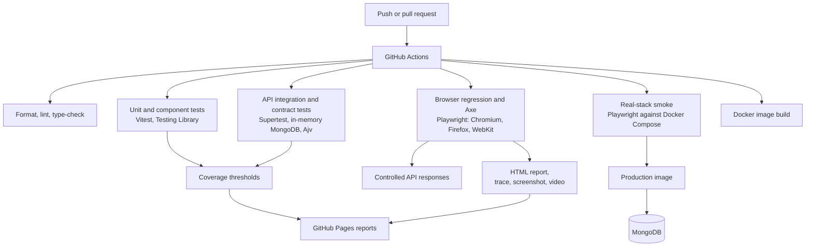

# QA Architecture

The strategy and the reasoning behind it are in [ADR 002](adr/002-layered-test-strategy.md). This page shows how the pieces fit and how to run them.

## Suites

| Suite                       | Location                                        | Runs                            | Purpose                                                                                                                   |
| --------------------------- | ----------------------------------------------- | ------------------------------- | ------------------------------------------------------------------------------------------------------------------------- |
| API unit and integration    | `src/server/__tests__/`                         | `npm run test:api`              | Routes, permissions and validation, plus tests that run the real app on a real (in-memory) MongoDB                        |
| Contract                    | `src/server/__tests__/openapi.contract.test.ts` | `npm run test:api`              | Every real response matches the OpenAPI schemas; the docs cannot drift                                                    |
| Frontend unit and component | `src/client/**/*.test.*`                        | `npm run test:unit`             | Format helpers, the API client, hooks (debounce, stale responses), components and the whole `App` with the network mocked |
| Mocked browser regression   | `tests/e2e-mocked`                              | `npm run test:e2e`              | User workflows across three browsers with deterministic API responses, using page objects and typed fixtures              |
| Accessibility               | `tests/accessibility`                           | `npm run test:a11y`             | Axe scans of the login, dashboard and ticket form                                                                         |
| Real-stack smoke            | `tests/smoke-live`                              | `npm run test:smoke:live`       | Nothing mocked: real frontend, API, database and browser. Needs `LIVE_SMOKE_ENABLED=true`                                 |
| Support monitoring          | `Support-Ops-Automation/tests`                  | `pytest`                        | The Python health, login and report tooling                                                                               |
| Screenshots                 | `tests/visual`                                  | `npm run screenshots:portfolio` | Chromium-only capture of the README images                                                                                |

## Numbers

| Suite                     | Tests | Executions          |
| ------------------------- | ----- | ------------------- |
| API (Vitest)              | 84    | 84                  |
| Frontend (Vitest)         | 94    | 94                  |
| Mocked browser regression | 19    | 57 (three browsers) |
| Accessibility (Axe)       | 3     | 9 (three browsers)  |
| Real-stack smoke          | 7     | 7 (Chromium)        |
| Support-Ops (pytest)      | 9     | 9                   |

Coverage is enforced by thresholds (API 88% statements / 78% branches, frontend 85% / 80%) and published with the Playwright report on GitHub Pages.

## Execution

- The root Playwright configuration runs the mocked and accessibility suites in Chromium, Firefox and WebKit.
- The live configuration uses Chromium only and runs serially to limit test-data risk. Its ticket test creates one uniquely named `PW-LIVE-` record and deletes it in a `finally` block.
- In CI the real-stack job builds the Docker image, starts the Compose stack, seeds it and runs the smoke suite against it. See [LIVE_SMOKE_TESTING.md](LIVE_SMOKE_TESTING.md).

## Diagnostics

Playwright keeps traces on retry, screenshots on failure and videos on failure. CI always uploads the HTML reports and uploads failure diagnostics only when a test command fails. Coverage reports are uploaded on every run and a summary appears on the workflow's job page.
