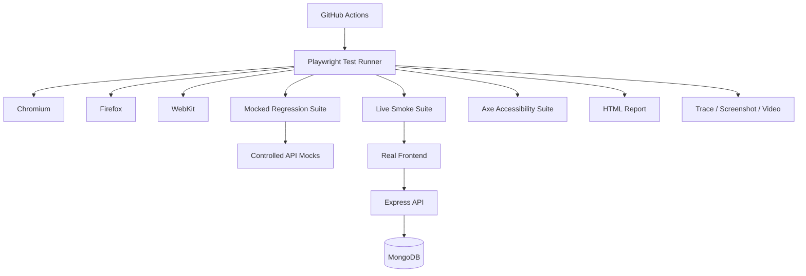

# QA Architecture

## Suites

- `tests/e2e-mocked`: deterministic TypeScript UI regression tests using fixtures, page objects, typed data, and controlled API responses.
- `tests/accessibility`: Axe scans of the mocked login, dashboard, and ticket-form states.
- `tests/smoke-live`: real integration checks that require an explicit enable flag and configured credentials; no mocks are installed.

## Execution

The root configuration runs mocked and accessibility coverage in Chromium, Firefox, and WebKit. The separate live configuration uses Chromium only and serial execution to limit test-data risk. CI uploads Playwright HTML reports and test-result artifacts after regression runs.

## Diagnostics

Playwright retains traces on retry, screenshots on failure, and videos on failure. The regression workflow uploads generated reports and test results even when a test command fails.
